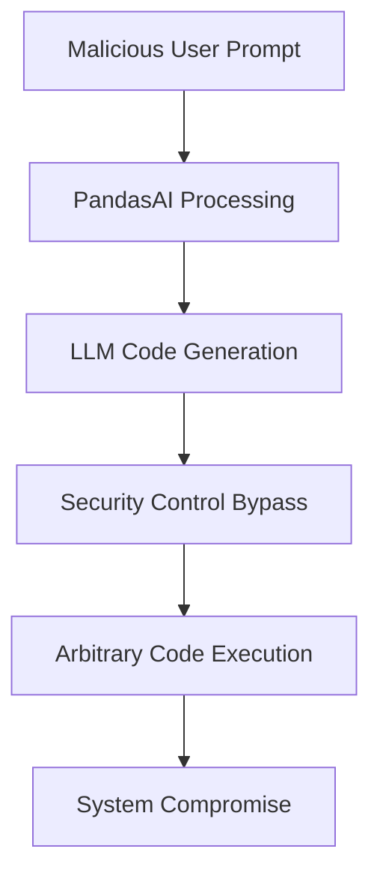

# CVE-2024-12366 - PandasAI Remote Code Execution Vulnerability

## 📋 Executive Summary

**CVE-2024-12366** is a critical code injection vulnerability in the PandasAI library that enables remote code execution through crafted prompt injection attacks. This vulnerability allows attackers to bypass security controls and execute arbitrary Python code by manipulating the library's interactive prompt functionality.

---

## 🚨 Quick Facts

| Metric | Details |
|--------|---------|
| **CVE ID** | CVE-2024-12366 |
| **CVSS Score** | 9.8 (Critical) (CISA/ADP) |
| **Vulnerability Type** | Code Injection (CWE-94)  |
| **Attack Vector** | Network  |
| **User Interaction** | None  |
| **Affected Product** | PandasAI Library  |
| **Affected Versions** | ≤ 2.4.3  |
| **Publication Date** | February 11, 2025  |

---

## 🔍 Technical Details

### Vulnerability Overview

CVE-2024-12366 exploits PandasAI's interactive prompt function, which is designed to provide natural language explanations of data analysis results through LLM processing. The vulnerability allows malicious prompt injection to execute arbitrary Python code instead of the intended data analysis operations .

### Technical Root Cause

The vulnerability stems from **improper control of code generation** (CWE-94) where PandasAI's security controls fail to distinguish between legitimate and malicious inputs . The library implicitly trusts all code generated and executed by its AI agent, allowing attackers to manipulate the system into executing untrusted code .

### Attack Mechanism



### Exploitation Vectors

- **Prompt Injection**: Attackers craft malicious natural language inputs that get translated into executable Python code 
- **Security Bypass**: Circumvention of module import restrictions and jailbreak protections 
- **Import Manipulation**: Bypassing allowed list validations for Python imports 

---

## 📊 Impact Assessment

### Potential Consequences

| Impact Category | Level | Description |
|----------------|-------|-------------|
| **Confidentiality** | 🔴 High | Complete information disclosure and data exfiltration  |
| **Integrity** | 🔴 High | Unauthorized data modification and system compromise  |
| **Availability** | 🔴 High | Service disruption and denial of service  |

### Attack Scenarios

- **System Compromise**: Full control over the host system running PandasAI 
- **Data Breach**: Exfiltration of sensitive data and credentials 
- **Pivoting Attacks**: Using compromised systems to attack connected services 
- **Persistence**: Establishment of backdoors and maintained access 

### CVSS 3.1 Vector Breakdown 

- **Attack Vector (AV)**: Network - Exploitable remotely over the network
- **Attack Complexity (AC)**: Low - No specialized conditions required
- **Privileges Required (PR)**: None - No authentication needed
- **User Interaction (UI)**: None - Zero-click exploitation
- **Scope (S)**: Unchanged - Affects only the vulnerable component

---

## 🛡️ Mitigation & Response

### Immediate Actions

#### 🔧 Patch Implementation
```bash
# Upgrade to patched version (check latest release)
pip install --upgrade pandasai

# Verify installation and version
pip show pandasai
```

#### ⚡ Emergency Workarounds
- **Input Validation**: Implement strict input sanitization for all user prompts
- **Access Controls**: Apply principle of least privilege to PandasAI processes
- **Network Segmentation**: Isolate PandasAI instances from sensitive systems

### Security Hardening

#### Security Configuration Levels
SinaptikAI has introduced three security configuration options :

1. **Standard Security**: Default settings with basic protections
2. **Advanced Security**: Stricter measures for high-risk environments  
3. **No Security**: Not recommended for production use

#### Recommended Defenses
- **Sandbox Environment**: Utilize the provided sandbox for code execution isolation 
- **Monitoring**: Deploy anomaly detection for unusual code execution patterns
- **Audit Logging**: Comprehensive logging of all prompt interactions and code generation

### Long-term Security Strategy

- **Regular Updates**: Establish process for continuous dependency updates
- **Security Testing**: Include prompt injection scenarios in security assessments
- **Architecture Review**: Implement additional security layers for AI components
- **Employee Training**: Security awareness for AI-specific threats

---

## 🔍 Detection & Monitoring

### Indicators of Compromise

#### 🚨 Suspicious Activity Patterns
- Unusual Python module imports in PandasAI processes
- Unexpected system command execution from application context
- Abnormal network connections from PandasAI instances
- Modified or new files in application directories

#### 🔍 Detection Strategies
- **Code Analysis**: Monitor for suspicious code patterns in LLM-generated outputs
- **Process Monitoring**: Audit child process creation from PandasAI
- **Network Monitoring**: Detect unusual outbound connections
- **Behavioral Analysis**: Anomaly detection in user prompt patterns

### Security Monitoring Recommendations

- **Application Logging**: Enhanced logging for all `ask()` method invocations
- **Performance Metrics**: Track unusual query execution times
- **Error Monitoring**: Investigate code execution failures and security exceptions

---

## 📈 Exploitation Status

### Current Threat Landscape

| Aspect | Status |
|--------|---------|
| **Proof of Concept** | No public evidence  |
| **Exploit Availability** | No evidence of active exploitation  |
| **Patch Availability** | Yes  |
| **EPSS Score** | 0.04% (Percentile: 11.5%)  |

### SSVC Analysis 

| Factor | Rating |
|--------|---------|
| **Exploitation** | None |
| **Automatable** | Yes |
| **Technical Impact** | Total |

---

## 🔮 Lessons Learned & Best Practices

### AI Security Considerations

#### Secure Development Practices
- **Zero Trust for AI**: Treat LLM-generated code as untrusted by default
- **Input Validation**: Implement strict allowlisting for prompt inputs
- **Output Sanitization**: Validate and sanitize AI-generated code before execution
- **Context Separation**: Maintain clear separation between user input and system instructions

#### Architecture Security
- **Sandboxing**: Essential containment for AI code execution workflows 
- **Permission Isolation**: Decouple AI processing from privileged operations
- **Defense in Depth**: Multiple security layers for AI-powered features

### Organizational Security Measures

- **Security Training**: Educate developers on prompt injection risks and mitigation
- **Code Review**: Security-focused reviews for AI integration code
- **Incident Response**: Prepare detection and response procedures for AI-specific attacks
- **Third-party Assessment**: Regular security assessments of AI components

---

## 📚 References & Resources

### Official Advisories
1. [CERT/CC Vulnerability Note VU#148244](https://www.kb.cert.org/vuls/id/148244) 
2. [NVD CVE-2024-5565 Detail](https://nvd.nist.gov/vuln/detail/CVE-2024-12366) 
3. [GitHub Security Advisory GHSA-vv2h-2w3q-3fx7](https://github.com/advisories/GHSA-vv2h-2w3q-3fx7) 

### Technical Resources
- [PandasAI Security Documentation](https://docs.pandas-ai.com/advanced-security-agent) 
- [OWASP LLM Security Top 10](https://owasp.org/www-project-top-10-for-large-language-model-applications/)
- [AI Security Best Practices](https://ai.security/)

### Community Resources
- [PandasAI Community Discussions](https://github.com/gventuri/pandas-ai/discussions)
- [AI Security Research Papers](https://arxiv.org/)

---

## ⚠️ Disclaimer

This document is provided for informational and educational purposes only. The vulnerability has been addressed in patched versions of PandasAI. Organizations should conduct their own risk assessment and testing before implementing any security measures. Always refer to official security advisories for the most current information.

---

<div align="center">

**Last Updated**: February 2025  
**Status**: ✅ **Patch Available**  

</div>
