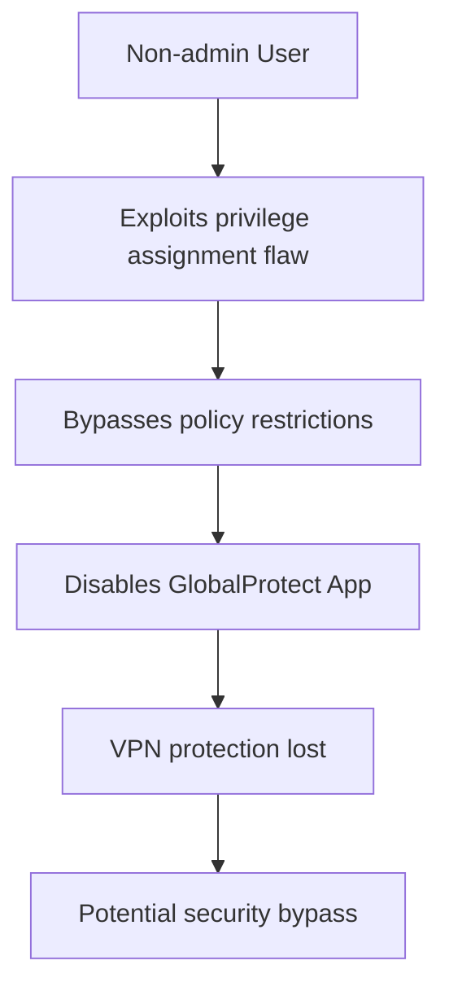

# CVE-2025-0140 - GlobalProtect App Privilege Escalation Vulnerability

## 📋 Executive Summary

**CVE-2025-0140** is a local privilege escalation vulnerability in Palo Alto Networks GlobalProtect App that allows non-administrative users on macOS devices to disable the VPN client even when organizational policies are configured to prevent this action. This incorrect privilege assignment undermines enterprise security controls by enabling users to bypass mandatory VPN protection.

---

## 🚨 Quick Facts

| Metric | Details |
|--------|---------|
| **CVE ID** | CVE-2025-0140 |
| **CVSS Score** | 6.8 (Medium) (CNA/Palo Alto Networks,Inc.) |
| **Vulnerability Type** | Incorrect Privilege Assignment (CWE-266)  |
| **Attack Vector** | Local  |
| **User Interaction** | None  |
| **Affected Product** | Palo Alto Networks GlobalProtect App  |
| **Affected Platforms** | macOS only  |
| **Publication Date** | July 9, 2025  |

---

## 🔍 Technical Details

### Vulnerability Overview

CVE-2025-0140 is an **incorrect privilege assignment vulnerability** (CWE-266) in the GlobalProtect App for macOS that enables locally authenticated non-administrative users to disable the VPN application against organizational policy . This vulnerability specifically affects the privilege boundary enforcement between user-level and system-level operations within the GlobalProtect client architecture.

### Attack Mechanism

The vulnerability exploits a flaw in how GlobalProtect App handles privilege separation on macOS systems. According to the technical analysis by researchers, this was part of a broader research initiative examining GlobalProtect's security architecture .



### Research Context

This vulnerability was discovered as part of comprehensive security research conducted by Alex Bourla and Graham Brereton between April and October 2024, which identified multiple vulnerabilities in GlobalProtect clients across different platforms . The research focused on two primary attack vectors:

- **VPN tunnel bypass mechanisms**
- **Local privilege escalation opportunities**

CVE-2025-0140 falls into the second category, specifically affecting the macOS implementation of the GlobalProtect client architecture .

---

## 📊 Impact Assessment

### Potential Consequences

| Impact Category | Level | Description |
|----------------|-------|-------------|
| **Availability** | 🔴 High | Complete VPN service disruption  |
| **Confidentiality** | 🟢 None | No direct data exposure |
| **Integrity** | 🟢 None | No direct data modification |

### Security Implications

- **Policy Bypass**: Circumvents organizational security policies requiring always-on VPN 
- **Network Protection Loss**: Eliminates VPN-based security controls and monitoring 
- **Access Control Bypass**: Undermines mandatory endpoint security enforcement 

### CVSS Vector Analysis

**CVSS v4.0: 6.8 Medium** 
- **Attack Vector**: Local (AV:L)
- **Privileges Required**: Low (PR:L)
- **User Interaction**: None (UI:N)
- **Attack Complexity**: Low (AC:L)

**CVSS v3.1: 5.5 Medium** 
- **Vector**: CVSS:3.1/AV:L/AC:L/PR:L/UI:N/S:U/C:N/I:N/A:H

---

## 🛡️ Mitigation & Response

### Patch Information

#### Affected Versions and Solutions 

| GlobalProtect Version | Affected macOS Versions | Fixed Versions |
|----------------------|------------------------|----------------|
| 6.3.x | 6.3.0 through 6.3.3 | >= 6.3.3-h1 (6.3.3-c650) |
| 6.2.x | 6.2.0 through 6.2.8 | >= 6.2.8-h2 (6.2.8-c243) |
| 6.1.x | All versions | Upgrade to 6.2.8-h2 or 6.3.3-h1 |
| 6.0.x | All versions | Upgrade to 6.2.8-h2 or 6.3.3-h1 |

#### Platform-Specific Notes

- **✅ Not Affected**: Windows, Linux, iOS, Android, Chrome OS 
- **✅ Not Affected**: GlobalProtect UWP App 
- **⚠️ Note**: Linux was initially included but later decoupled to CVE-2025-2179 

### Remediation Steps

#### Immediate Actions
```bash
# For GlobalProtect App 6.3.x on macOS
Upgrade to 6.3.3-h1 (6.3.3-c650) or later

# For GlobalProtect App 6.2.x on macOS  
Upgrade to 6.2.8-h2 (6.2.8-c243) or later

# For GlobalProtect App 6.1.x and 6.0.x on macOS
Upgrade to 6.2.8-h2 or 6.3.3-h1 or later
```

#### Enterprise Deployment Considerations
- **Urgency**: Moderate - Patch within standard maintenance cycles 
- **Response Effort**: Moderate - Requires client deployment 
- **Recovery**: User-level - No system reboot required 

### Workarounds and Compensating Controls

- **No direct workarounds** available according to Palo Alto Networks 
- **Network-level monitoring** for unexpected VPN disconnections
- **Endpoint detection** for GlobalProtect process termination events

---

## 🔍 Detection & Monitoring

### Indicators of Compromise

#### Behavioral Indicators
- Unexpected GlobalProtect App termination by non-admin users
- VPN connection drops without legitimate administrative action
- Security policy violations related to mandatory VPN usage

#### System Monitoring
- Monitor for GlobalProtect service interruptions
- Audit logs for unauthorized application control attempts
- Track user-initiated VPN disconnections against policy

### Security Assessment

- **Exploit Availability**: No public exploits known 
- **Exploitation Status**: No evidence of malicious exploitation 
- **EPSS Score**: 0.03% (low probability of exploitation) 

---

## 📈 Vulnerability Context

### Research Background

This vulnerability was identified during broader security research into GlobalProtect clients, which revealed several architectural weaknesses . The research presentation was delivered at Black Hat USA 2025, highlighting systemic issues in enterprise VPN client security .

### Related Vulnerabilities

The same research team discovered multiple related issues in GlobalProtect clients :

- **CVE-2025-0135**: VPN bypass via forged IPC disconnect (macOS)
- **CVE-2025-2179**: VPN bypass via forged IPC disconnect (Linux)
- **CVE-2025-0141**: Privilege escalation via SUID binary abuse

---

## 🔮 Lessons Learned & Best Practices

### Enterprise Security Considerations

#### Patch Management
- **Prioritize Updates**: Include VPN client updates in standard patch cycles
- **Version Awareness**: Maintain inventory of GlobalProtect client versions
- **Policy Verification**: Regularly audit VPN enforcement policies

#### Defense in Depth
- **Network Monitoring**: Implement secondary network access controls
- **Endpoint Security**: Deploy complementary endpoint protection
- **User Education**: Train users on VPN security importance

### Vendor Security Recommendations

- **Architecture Review**: Regular security assessment of client privilege models
- **Patch Verification**: Independent validation of security fixes
- **Threat Modeling**: Comprehensive analysis of local attack surfaces

---

## 📚 References & Resources

### Official Advisories
1. [Palo Alto Networks Security Advisory - CVE-2025-0140](https://security.paloaltonetworks.com/CVE-2025-0140) 
2. [NVD CVE-2025-0140 Detail](https://nvd.nist.gov/vuln/detail/CVE-2025-0140) 

### Technical Analysis
1. [Turning the Tables on GlobalProtect: Behind the CVEs](https://alexbourla.com/research/turning-the-tables-on-globalprotect/) 
2. [CVE Details - CVE-2025-0140](https://www.cvedetails.com/cve/CVE-2025-0140/) 

### Additional Resources
- [CISA Vulnerability Bulletin](https://www.cisa.gov/news-events/bulletins/sb25-195) 
- [Tenable CVE-2025-0140 Analysis](https://www.tenable.com/cve/CVE-2025-0140) 

---

## ⚠️ Disclaimer

This document is provided for informational and educational purposes only. The vulnerability has been addressed in patched versions of GlobalProtect App. Organizations should conduct their own risk assessment and testing before implementing any security measures. Always refer to official security advisories for the most current information.

---

<div align="center">

**Last Updated**: November 2025  
**Status**: ✅ **Patched - Update Recommended**  

</div>
