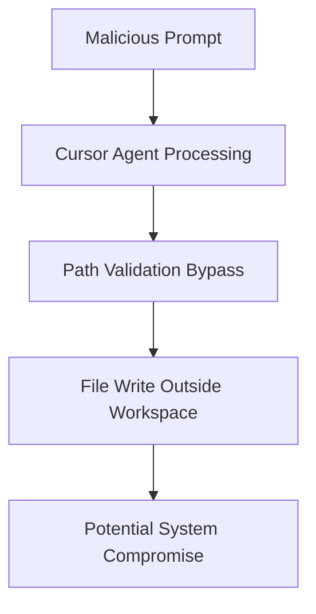

# CVE-2025-32018 - Cursor AI Agent Path Traversal Vulnerability

## 📋 Executive Summary

**CVE-2025-32018** is a high-severity path traversal vulnerability in the Cursor code editor that allowed the AI-powered Cursor Agent to write files outside the opened workspace under specific conditions. This security regression in the editor's file path restrictions could potentially enable unauthorized file modifications through deliberate prompt manipulation.

---

## 🚨 Quick Facts

| Metric | Details |
|--------|---------|
| **CVE ID** | CVE-2025-32018 |
| **CVSS Score** | 8.0 (High) (CNA/GitHub,Inc.) |
| **Vulnerability Type** | Path Traversal (CWE-22)  |
| **Attack Vector** | Network  |
| **User Interaction** | Required  |
| **Affected Product** | Cursor Code Editor |
| **Affected Versions** | 0.45.0 through 0.48.6  |
| **Patched Version** | 0.48.7  |
| **Publication Date** | April 8, 2025  |

---

## 🔍 Technical Details

### Vulnerability Overview

CVE-2025-32018 was a **path traversal vulnerability** (CWE-22) in the Cursor code editor that introduced a regression in the Cursor Agent's file path permissions . This security flaw allowed the AI agent to be manipulated into writing files outside the intended workspace directory when specifically prompted under certain conditions.

### Attack Mechanism

The vulnerability exploited a regression in the Cursor Agent's path validation system, where:



### Technical Root Cause

- **Weakness**: CWE-22 - Improper Limitation of a Pathname to a Restricted Directory ('Path Traversal') 
- **Component**: Cursor Agent file path modification permissions 
- **Impact**: Arbitrary file write capabilities outside workspace boundaries 

### Exploitation Requirements

Successful exploitation required specific conditions:
- **Deliberate prompting** by the user or via maliciously crafted context 
- **User interaction** was necessary for the attack to succeed 
- The vulnerability was considered **highly impractical** for real-world exploitation 

---

## 📊 Impact Assessment

### Potential Consequences

| Impact Category | Level | Description |
|----------------|-------|-------------|
| **Confidentiality** | 🔴 High | Potential exposure of sensitive system files  |
| **Integrity** | 🔴 High | Unauthorized modification of critical files  |
| **Availability** | 🔴 High | Potential system disruption through file corruption  |

### CVSS 3.1 Vector Breakdown 

- **Attack Vector (AV)**: Network - Exploitable over network connections
- **Attack Complexity (AC)**: High - Requires specific conditions and user interaction
- **Privileges Required (PR)**: Low - User-level privileges sufficient
- **User Interaction (UI)**: Required - Needs deliberate user action
- **Scope (S)**: Changed - Can affect components beyond security scope

### Real-World Exploitation Likelihood

- **Exploitation Status**: No evidence of active exploitation 
- **Public Exploits**: No proof-of-concept available 
- **EPSS Score**: 0.09% probability of exploitation 
- **Practical Challenges**: Highly impractical due to required user interaction and UI visibility 

---

## 🛡️ Mitigation & Response

### Immediate Actions

#### 🔧 Patch Implementation
```bash
# Upgrade to patched version
# Fixed in Cursor version 0.48.7 and later
cursor --update  # Or download from official sources
```

#### ⚡ Verification Steps
- Verify Cursor version in settings (≥ 0.48.7)
- Review recent AI-suggested file modifications
- Audit workspace directory permissions

### Security Recommendations

#### For Developers
- **Update Immediately**: Upgrade to Cursor 0.48.7 or later 
- **Code Review**: Scrutinize AI-suggested file modifications before acceptance
- **Access Controls**: Implement principle of least privilege for workspace directories
- **Monitoring**: Enable file system auditing for sensitive directories

#### For Organizations
- **Security Awareness**: Train developers on AI tool security risks
- **Policy Enforcement**: Establish guidelines for AI code assistant usage
- **Environment Isolation**: Run Cursor in sandboxed environments when possible
- **Backup Strategies**: Maintain regular backups of critical development files

### Compensating Controls

- **File System Monitoring**: Deploy tools to detect unusual file modification patterns
- **Permission Hardening**: Restrict write permissions outside development directories
- **Network Segmentation**: Limit Cursor's network access in sensitive environments

---

## 🔍 Detection & Monitoring

### Indicators of Compromise

#### 🚨 Suspicious Activity Patterns
- Unexpected file modifications outside workspace directories
- AI agent attempting to access system files or directories
- Unusual prompt patterns targeting file system operations
- Changes to critical configuration files without clear justification

#### 🔍 Security Monitoring
- **File Integrity Monitoring**: Track modifications to system files
- **Process Auditing**: Monitor Cursor Agent file operations
- **User Behavior Analytics**: Detect anomalous prompt patterns
- **Log Analysis**: Review Cursor application logs for path traversal attempts

### Post-Exploitation Detection

- Review Cursor's built-in edit history and file change logs
- Examine system audit logs for unauthorized file modifications
- Monitor for unexpected changes in system behavior or configuration

---

## 📈 Exploitation Status

### Current Threat Landscape

| Aspect | Status |
|--------|---------|
| **Proof of Concept** | Not Available  |
| **Active Exploitation** | No Evidence  |
| **Exploit Availability** | None  |
| **Patch Availability** | Yes (Version 0.48.7+)  |

### SSVC Analysis 

| Factor | Rating |
|--------|---------|
| **Exploitation** | None |
| **Automatable** | No |
| **Technical Impact** | Total |

---

## 🔮 Lessons Learned & Best Practices

### AI Security Considerations

#### Secure Development Practices
- **Input Validation**: Implement robust path sanitization for AI-generated operations
- **Sandboxing**: Execute AI agent operations in isolated environments
- **Permission Boundaries**: Enforce strict file system access controls
- **Audit Trails**: Maintain comprehensive logs of AI agent activities

#### Organizational Security Measures
- **Vendor Monitoring**: Subscribe to security advisories for AI development tools
- **Patch Management**: Establish rapid update procedures for critical vulnerabilities
- **Risk Assessment**: Evaluate security implications of AI-powered development tools
- **Incident Response**: Prepare procedures for AI tool security incidents

### Future Prevention Strategies

- **Security Testing**: Include AI components in penetration testing scope
- **Code Review**: Enhance scrutiny of AI integration code
- **User Education**: Develop security awareness for AI-assisted development
- **Vendor Communication**: Establish channels for reporting security concerns

---

## 📚 References & Resources

### Official Advisories
1. [GitHub Security Advisory - GHSA-qjh8-mh96-fc86](https://github.com/getcursor/cursor/security/advisories/GHSA-qjh8-mh96-fc86) 
2. [NVD CVE-2025-32018 Detail](https://nvd.nist.gov/vuln/detail/CVE-2025-32018) 
3. [CVE Details - CVE-2025-32018](https://www.cvedetails.com/cve/CVE-2025-32018/) 

### Additional Resources
- [Cursor Official Website](https://cursor.sh/) for latest downloads
- [AI Security Best Practices](https://learnprompting.org/docs/category/-security)
- [Path Traversal Prevention Guide](https://owasp.org/www-community/attacks/Path_Traversal)

### Related CVEs
- **CWE-22**: Improper Limitation of a Pathname to a Restricted Directory
- Similar AI tool vulnerabilities in prompt injection and path manipulation categories

---

## ⚠️ Disclaimer

This document is provided for informational and educational purposes only. The vulnerability has been addressed in Cursor version 0.48.7 and later. Organizations should conduct their own risk assessment and testing before implementing any security measures. Always refer to official security advisories for the most current information.

---

<div align="center">

**Last Updated**: November 2024  
**Status**: ✅ **Patched in version 0.48.7**  

</div>
