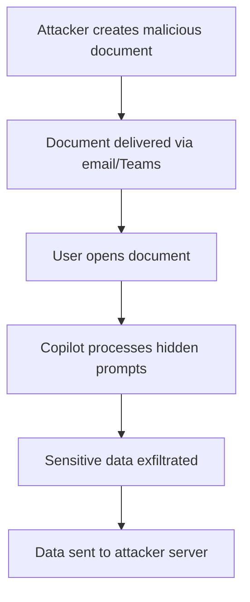

# CVE-2025-32711 (EchoLeak) - Technical Analysis

## 📋 Executive Summary

**CVE-2025-32711**, publicly known as **"EchoLeak"**, is a critical zero-click AI command injection vulnerability affecting Microsoft 365 Copilot. This vulnerability enables unauthorized attackers to remotely exfiltrate sensitive organizational data without any user interaction through specially crafted prompt injections.

---

## 🚨 Quick Facts

| Metric | Details |
|--------|---------|
| **CVE ID** | CVE-2025-32711 |
| **Common Name** | EchoLeak |
| **CVSS Score** | 9.3 (Critical) |
| **Vulnerability Type** | AI Command Injection (CWE-77) |
| **Attack Vector** | Network |
| **User Interaction** | None (Zero-click) |
| **Affected Product** | Microsoft 365 Copilot |
| **Publication Date** | June 11, 2025 |

---

## 🔍 Technical Details

### Vulnerability Classification
- **CWE**: 77 - Improper Neutralization of Special Elements used in a Command
- **Attack Complexity**: Low
- **Privileges Required**: None
- **Scope**: Changed

### Attack Flow



### Exploitation Techniques

#### 1. **Prompt Injection**
Malicious instructions embedded in:
- 📝 Hidden text and comments
- 🎯 Speaker notes in presentations  
- 📧 Email metadata
- 🔗 Document properties

#### 2. **Data Exfiltration Methods**
- **Image-based exfiltration**: Data embedded in image URLs
- **Markdown manipulation**: Bypass of content filters
- **Reference-style links**: Evasion of link detection

#### 3. **Security Bypasses**
- ✅ Cross-Prompt Injection Attack (XPIA) classifier bypass
- ✅ External link redaction evasion
- ✅ Content Security Policy circumvention

---

## 📊 Impact Assessment

### Severity Metrics

| Impact Category | Level | Description |
|----------------|-------|-------------|
| **Confidentiality** | 🔴 High | Total information disclosure |
| **Integrity** | 🟡 Low | Limited data modification |
| **Availability** | 🟢 None | No service impact |

### Potential Consequences

- 🔓 **Mass data exfiltration** of emails, documents, and chat logs
- 🎯 **Zero-user interaction** required for exploitation  
- 🌐 **Cross-platform functionality** (Word, PowerPoint, Outlook, Teams)
- 🕵️ **Stealth operation** - no traditional IoCs

---

## 🛡️ Mitigation & Response

### Microsoft's Actions
- ✅ **Server-side patches** deployed automatically
- ✅ **Enhanced XPIA classifiers** 
- ✅ **Improved link redaction mechanisms**
- ✅ **Strengthened content security policies**

### Organizational Recommendations

#### 🔧 Configuration Hardening
```bash
# Recommended security controls:
1. Audit Copilot access permissions
2. Disable external email context processing  
3. Implement data sensitivity labels
4. Restrict Markdown rendering capabilities
```

#### 📋 Security Best Practices
- **Data Access Control**: Apply principle of least privilege to Copilot data access
- **Content Sanitization**: Strip hidden text and metadata from shared documents
- **Network Monitoring**: Detect unusual outbound connections
- **Employee Training**: AI-specific security awareness programs

---

## 📈 CVSS 3.1 Breakdown

| Vector | Value | Description |
|--------|-------|-------------|
| **AV** | N | Attack Vector: Network |
| **AC** | L | Attack Complexity: Low |  
| **PR** | N | Privileges Required: None |
| **UI** | N | User Interaction: None |
| **S** | C | Scope: Changed |
| **C** | H | Confidentiality: High |
| **I** | L | Integrity: Low |
| **A** | N | Availability: None |

---

## 🔮 Future Considerations

### Emerging Threat Landscape
- 🤖 **AI-specific attack vectors** becoming more prevalent
- 💬 **Natural language payloads** bypassing traditional security
- 🔗 **RAG architecture challenges** in maintaining trust boundaries

### Security Evolution
- 🛡️ **Zero-trust principles** for AI systems
- 🔍 **Comprehensive testing** for prompt injection scenarios  
- 📚 **Adoption of AI security frameworks** (OWASP LLM Top 10)

---

## 📚 References

1. [Microsoft Security Response Center](https://msrc.microsoft.com/update-guide/vulnerability/CVE-2025-32711)
2. [NVD - CVE-2025-32711](https://nvd.nist.gov/vuln/detail/CVE-2025-32711)  
3. [OWASP LLM Security Top 10](https://owasp.org/www-project-top-10-for-large-language-model-applications/)

---

## ⚠️ Disclaimer

This document is provided for informational and educational purposes only. The vulnerability has been patched by Microsoft, and no customer action is required. Always refer to official Microsoft security advisories for the most current information.

---

<div align="center">

**Last Updated**: August 2025  
**Status**: ✅ Patched - No Action Required

</div>
