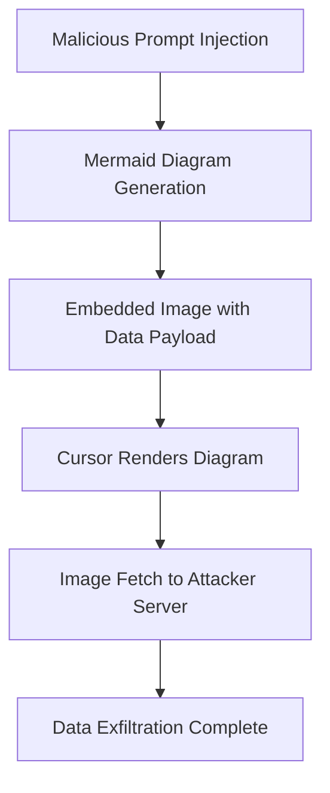

# CVE-2025-54132 - Cursor AI Mermaid Diagram Data Exfiltration Vulnerability

## 📋 Executive Summary

**CVE-2025-54132** is a medium-severity Server-Side Request Forgery (SSRF) vulnerability in the Cursor AI code editor that allows sensitive information exfiltration through malicious Mermaid diagram image embedding. This vulnerability combines prompt injection techniques with Mermaid's image rendering capability to leak data to attacker-controlled servers.

---

## 🚨 Quick Facts

| Metric | Details |
|--------|---------|
| **CVE ID** | CVE-2025-54132 |
| **CVSS Score** | 7.5 (High) (NIST/NVD) |
| **Vulnerability Type** | Server-Side Request Forgery (SSRF)  |
| **Attack Vector** | Network  |
| **User Interaction** | None  |
| **Affected Product** | Cursor AI Code Editor |
| **Affected Versions** | < 1.3  |
| **Patched Version** | 1.3  |
| **Publication Date** | August 1, 2025  |

---

## 🔍 Technical Details

### Vulnerability Overview

CVE-2025-54132 exploits the integration between Cursor's AI chat functionality and Mermaid diagram rendering. The vulnerability allows attackers to embed malicious image references in Mermaid diagrams that, when rendered, exfiltrate sensitive information to external servers .

### Attack Mechanism



### Technical Root Cause

- **Weakness**: CWE-918 - Server-Side Request Forgery (SSRF) 
- **Component**: Mermaid diagram rendering in Cursor chat interface
- **Attack Vectors**: Prompt injection through web content, image uploads, or source code 
- **Trigger Conditions**: Malicious model, hallucination, or backdoor could trigger exploit 

### Exploitation Requirements

Successful exploitation requires specific preconditions:
- **Initial Access**: Ability to perform prompt injection through various input methods
- **Privileges**: High privileges are typically required 
- **Trigger Mechanism**: Malicious data processing through Cursor's AI features

---

## 📊 Impact Assessment

### Potential Consequences

| Impact Category | Level | Description |
|----------------|-------|-------------|
| **Confidentiality** | 🔴 High | Sensitive information disclosure via exfiltration  |
| **Integrity** | 🟢 None | No integrity impact  |
| **Availability** | 🟢 None | No availability impact  |

### CVSS 3.1 Vector Breakdown 

- **Attack Vector (AV)**: Network - Exploitable over network connections
- **Attack Complexity (AC)**: High - Requires specific preconditions
- **Privileges Required (PR)**: High - Elevated privileges needed
- **User Interaction (UI)**: None - Automatic exploitation possible
- **Scope (S)**: Unchanged - Affects only vulnerable component

### Real-World Risk Assessment

- **Exploitation Status**: No evidence of active exploitation 
- **Public Exploits**: No proof-of-concept available 
- **EPSS Score**: 0.03% probability of exploitation 
- **Business Impact**: Potential leakage of proprietary code and sensitive development data

---

## 🛡️ Mitigation & Response

### Immediate Actions

#### 🔧 Patch Implementation
```bash
# Upgrade to patched version
# Fixed in Cursor version 1.3 and later
cursor --update  # Or download from official sources
```

#### ⚡ Verification Steps
- Verify Cursor version in settings (≥ 1.3)
- Review recent AI interactions for suspicious diagram generation
- Monitor outbound network connections for unusual image fetches

### Security Hardening

#### Configuration Recommendations
- **Input Validation**: Implement strict validation for AI prompts and uploaded content 
- **Network Controls**: Restrict external image rendering and monitor outbound connections 
- **Access Management**: Apply principle of least privilege for AI feature access 
- **Content Filtering**: Deploy filtering for Mermaid diagram image embeddings

#### Compensating Controls
- **Network Segmentation**: Isolate development environments from production systems
- **Egress Filtering**: Block unnecessary outbound connections from development workstations
- **Monitoring**: Deploy anomaly detection for unusual external image requests

### Long-term Security Strategy

- **AI Security Training**: Educate developers on prompt injection risks and safe AI tool usage
- **Code Review**: Enhance security reviews for AI-integrated development tools
- **Vendor Management**: Establish processes for tracking AI tool security updates
- **Incident Response**: Prepare procedures for AI-assisted development tool compromises

---

## 🔍 Detection & Monitoring

### Indicators of Compromise

#### 🚨 Suspicious Activity Patterns
- Unexpected Mermaid diagram generation in AI chat sessions
- Unusual outbound HTTP requests to unknown domains during coding sessions
- AI-generated content containing external image references
- Anomalous network traffic patterns from Cursor application

#### 🔍 Security Monitoring
- **Network Monitoring**: Detect image fetches to unrecognized external domains
- **Application Logging**: Enhanced logging for AI chat interactions and diagram rendering
- **Behavioral Analysis**: Anomaly detection in developer-AI interaction patterns
- **File Integrity Monitoring**: Track changes to Cursor configuration and extension files

### Detection Signatures

- Monitor for Mermaid syntax containing external image URLs in AI responses
- Alert on HTTP requests containing sensitive data in URL parameters to image hosts
- Detect unusual timing or frequency of diagram generation in coding sessions

---

## 📈 Exploitation Status

### Current Threat Landscape

| Aspect | Status |
|--------|---------|
| **Proof of Concept** | Not Available  |
| **Active Exploitation** | No Evidence  |
| **Exploit Availability** | None |
| **Patch Availability** | Yes (Version 1.3+)  |

### SSVC Analysis 

| Factor | Rating |
|--------|---------|
| **Exploitation** | None |
| **Automatable** | No |
| **Technical Impact** | Partial |

---

## 🔮 Lessons Learned & Best Practices

### AI Integration Security

#### Secure Development Practices
- **Zero Trust for AI Outputs**: Treat AI-generated content as untrusted by default
- **Output Sanitization**: Implement robust sanitization for AI-generated code and visualizations
- **Content Security Policies**: Enforce strict CSP for embedded content rendering
- **Input Validation**: Comprehensive validation for all AI prompt inputs and file uploads

#### Architecture Considerations
- **Sandboxing**: Execute AI-generated visualizations in isolated environments
- **Network Security**: Default-deny egress policies for development tools
- **Access Control**: Granular permissions for AI feature usage
- **Audit Logging**: Comprehensive logging of AI interactions and rendered content

### Organizational Security Measures

- **Vendor Security Assessment**: Evaluate AI tool security postures before adoption
- **Patch Management**: Rapid update procedures for critical development tools
- **Security Awareness**: Training for developers on AI tool security risks
- **Threat Modeling**: Include AI components in application threat models

---

## 📚 References & Resources

### Official Advisories
1. [GitHub Security Advisory - GHSA-43wj-mwcc-x93p](https://github.com/cursor/cursor/security/advisories/GHSA-43wj-mwcc-x93p) 
2. [NVD CVE-2025-54132 Detail](https://nvd.nist.gov/vuln/detail/CVE-2025-54132) 
3. [CISA Vulnerability Bulletin](https://www.cisa.gov/news-events/bulletins/sb25-216) 

### Additional Resources
- [Cursor Official Website](https://cursor.sh/) for latest downloads
- [Mermaid.js Documentation](https://mermaid.js.org/) for diagram security considerations
- [OWASP SSRF Prevention Guide](https://cheatsheetseries.owasp.org/cheatsheets/Server_Side_Request_Forgery_Prevention_Cheat_Sheet.html)

### Related CVEs
- **CWE-918**: Server-Side Request Forgery
- Similar AI tool vulnerabilities in prompt injection and data exfiltration categories

---

## ⚠️ Disclaimer

This document is provided for informational and educational purposes only. The vulnerability has been addressed in Cursor version 1.3 and later. Organizations should conduct their own risk assessment and testing before implementing any security measures. Always refer to official security advisories for the most current information.

---

<div align="center">

**Last Updated**: November 2024  
**Status**: ✅ **Patched in version 1.3**  

</div>
