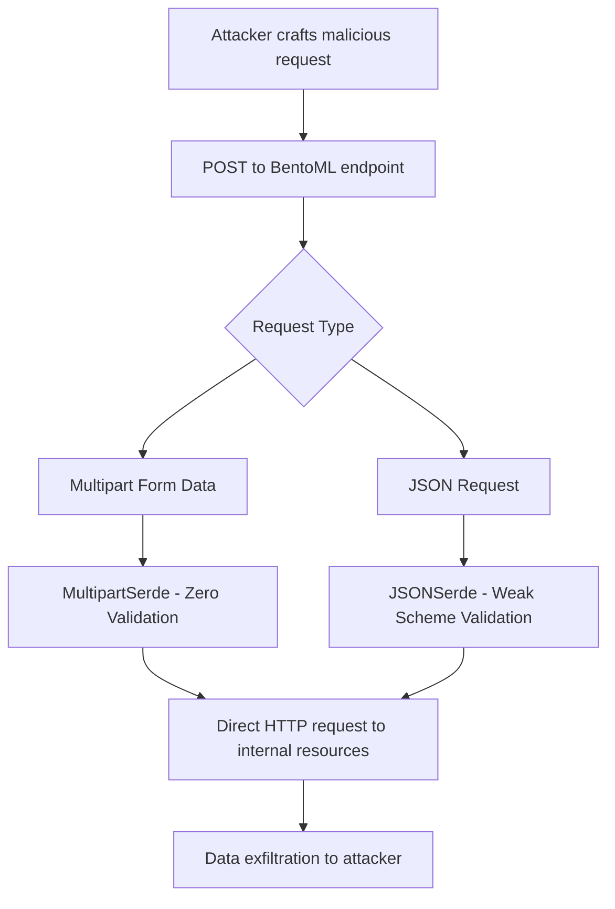

# CVE-2025-54381 - BentoML Server-Side Request Forgery (SSRF) Vulnerability

## 📋 Executive Summary

**CVE-2025-54381** is a critical Server-Side Request Forgery (SSRF) vulnerability discovered in BentoML, a popular Python framework for building and deploying machine learning model serving systems. This vulnerability allows unauthenticated remote attackers to force BentoML servers to make arbitrary HTTP requests to internal networks, cloud metadata services, and other restricted resources, potentially leading to sensitive information disclosure and further system compromise.

---

## 🚨 Quick Facts

| Metric | Details |
| :--- | :--- |
| **CVE ID** | CVE-2025-54381 |
| **CVSS Score** | 9.9 (Critical) (CNA/GitHub,Inc.) |
| **Vulnerability Type** | Server-Side Request Forgery (CWE-918)  |
| **Attack Vector** | Network |
| **User Interaction** | None |
| **Affected Product** | BentoML AI Model Serving Framework |
| **Affected Versions** | 1.4.0 through 1.4.18  |
| **Patched Version** | 1.4.19  |
| **Publication Date** | July 29, 2025  |
| **Exploit Availability** | Proof-of-Concept Available  |

---

## 🔍 Technical Details

### Vulnerability Overview

CVE-2025-54381 is a critical **Server-Side Request Forgery (SSRF)** vulnerability in BentoML's file upload processing system that enables unauthenticated remote attackers to make arbitrary HTTP requests from vulnerable servers. The vulnerability affects the framework's serialization/deserialization handlers for both multipart form data and JSON requests, which automatically download files from user-provided URLs without proper validation of whether those URLs point to internal network resources.

### Attack Mechanism



### Technical Root Cause

The vulnerability stems from two distinct attack paths in BentoML's request processing system:

#### Path 1: MultipartSerde (No Validation)
- **Source**: User-controlled multipart form field values containing URLs
- **Call Chain**: `MultipartSerde.parse_request()` → `MultipartSerde.ensure_file()` 
- **Sink**: `resp = await client.get(obj)` at line 193 with zero validation
- **Impact**: Direct HTTP requests to any URL without any security checks

#### Path 2: JSONSerde (Weak Validation)  
- **Source**: JSON request bodies containing URLs to endpoints with `IORootModel + multipart_fields`
- **Call Chain**: `JSONSerde.parse_request()` → weak `is_http_url()` validation
- **Sink**: `resp = await client.get(url)` at line 168 after insufficient validation
- **Impact**: HTTP requests after basic scheme checking only

### Exploitation Techniques

#### Proof of Concept
Create a vulnerable BentoML service:
```python
from pathlib import Path
import bentoml

@bentoml.service  
class ImageProcessor:
    @bentoml.api
    def process_image(self, image: Path) -> str:
        return f"Processed image: {image}"
```

Exploitation examples:
```bash
# SSRF to AWS metadata service
curl -X POST http://target:3000/process_image -F 'image=http://169.254.169.254/latest/meta-data/'

# Internal service enumeration
curl -X POST http://target:3000/process_image -F 'image=http://localhost:8080/admin'

# Internal network scanning
curl -X POST http://target:3000/process_image -F 'image=http://10.0.0.1:22'
```

#### Critical Design Flaw
The vulnerability is particularly dangerous because BentoML **automatically registers any service endpoint with file-type parameters** (such as `pathlib.Path` or `PIL.Image.Image`) as vulnerable to this attack. This makes SSRF exposure a framework-wide security issue affecting most real-world ML services handling file uploads.

---

## 📊 Impact Assessment

### Potential Consequences

| Impact Category | Level | Description |
| :--- | :--- | :--- |
| **Confidentiality** | 🔴 High | Access to cloud metadata, internal APIs, and sensitive services  |
| **Integrity** | 🟡 Low | Potential data manipulation through internal service interaction |
| **Availability** | 🟡 Low | Possible service disruption through resource exhaustion |

### Attack Scenarios

- **Cloud Credential Theft**: Access to AWS/GCP/Azure metadata services for credential harvesting 
- **Internal Network Reconnaissance**: Enumerate and interact with internal HTTP services and APIs 
- **Firewall Bypass**: Circumvent network security controls to reach protected internal resources 
- **Sensitive Data Exposure**: Retrieve confidential information disclosed in HTTP responses 

### CVSS 3.1 Vector Breakdown
- **Attack Vector (AV)**: Network - Exploitable remotely over the network
- **Attack Complexity (AC)**: Low - No specialized conditions required
- **Privileges Required (PR)**: None - No authentication needed
- **User Interaction (UI)**: None - Zero-click exploitation
- **Scope (S)**: Changed - Can affect components beyond the vulnerable application

---

## 🛡️ Mitigation & Response

### Immediate Actions

#### 🔧 Patch Implementation
```bash
# Upgrade to patched version
pip install --upgrade bentoml>=1.4.19

# Verify installation
pip show bentoml
```

#### 🚨 Emergency Workarounds
- **Network Segmentation**: Restrict outbound network access from BentoML servers
- **Input Validation**: Implement custom middleware to validate all user-provided URLs
- **Service Isolation**: Deploy BentoML in isolated network segments without internal access

### Patch Analysis

The vulnerability is fixed in version 1.4.19 through comprehensive validation mechanisms:

#### Key Security Enhancements
- **URL Scheme Validation**: Strict validation of allowed URL schemes (http, https only)
- **Internal Network Restriction**: Block access to private IP ranges (10.0.0.0/8, 172.16.0.0/12, 192.168.0.0/16)
- **Localhost Protection**: Prevent access to localhost and loopback addresses
- **Enhanced Deserialization**: Security improvements in both MultipartSerde and JSONSerde handlers

#### Patch Code Example
```python
import ipaddress
import urllib.parse

ALLOWED_SCHEMES = {"http", "https"}
INTERNAL_IP_RANGES = [
    ipaddress.ip_network("10.0.0.0/8"),
    ipaddress.ip_network("172.16.0.0/12"),
    ipaddress.ip_network("192.168.0.0/16"),
    ipaddress.ip_network("127.0.0.0/8"),
    ipaddress.ip_network("::1/128"),
]

def is_internal_address(url):
    parsed_url = urllib.parse.urlparse(url)
    if parsed_url.scheme not in ALLOWED_SCHEMES:
        return True
    try:
        host_ip = ipaddress.ip_address(socket.gethostbyname(parsed_url.hostname))
        return any(host_ip in net for net in INTERNAL_IP_RANGES)
    except ValueError:
        return True
    return False
```

### Security Hardening Recommendations

#### Network Security
- **Egress Filtering**: Implement strict outbound firewall rules for application servers
- **Cloud Metadata Protection**: Use cloud provider features to restrict metadata service access
- **API Gateway Protection**: Deploy WAF with SSRF protection rules

#### Application Security
- **Input Validation**: Implement allowlist-based validation for all external inputs
- **Security Headers**: Deploy appropriate security headers and content security policies
- **Monitoring & Logging**: Comprehensive logging of all file upload activities and external requests

---

## 🔍 Detection & Monitoring

### Indicators of Compromise

#### 🚨 Suspicious Activity Patterns
- Unusual outbound HTTP requests from BentoML servers to internal IP addresses
- Requests to cloud metadata endpoints (169.254.169.254, etc.)
- Access patterns to localhost services from application context
- Abnormal file upload patterns containing URL parameters

#### 🔍 Detection Strategies

**Network Monitoring**
```yaml
# Suricata rule for SSRF detection
alert http any any -> $HOME_NET any (
    msg:"BentoML SSRF Exploit Attempt";
    flow:to_server;
    http.method; content:"POST";
    http.uri; content:"/process_image";
    http.header; content:"multipart/form-data";
    threshold:type limit, track by_src, count 5, seconds 60;
    reference:cve,2025-54381;
)
```

**Application Logging**
- Monitor for exceptions in BentoML logs containing internal IP addresses
- Alert on failed file upload attempts from external URLs
- Log all URL-based file upload operations with source and destination details

### Security Assessment

1. **Code Review**: Analyze custom BentoML services for file-type parameter usage
2. **Penetration Testing**: Conduct SSRF testing against BentoML deployments
3. **Dependency Scanning**: Ensure BentoML version is 1.4.19 or newer

---

## 📈 Exploitation Status

### Current Threat Landscape

| Aspect | Status |
| :--- | :--- |
| **Proof of Concept** | Publicly Available  |
| **Exploit Maturity** | Functional Exploit Code  |
| **Patch Bypass** | Initial patch reportedly bypassed  |
| **Active Exploitation** | No evidence of widespread exploitation |

### SSVC Analysis 

| Factor | Rating |
| :--- | :--- |
| **Exploitation** | PoC Available |
| **Automatable** | Yes |
| **Technical Impact** | Partial |

---

## 🔮 Lessons Learned & Best Practices

### AI Security Considerations

#### Secure Development Practices
- **Zero Trust for External Inputs**: Never trust user-provided URLs without rigorous validation
- **Default Security**: Security controls should be enabled by default, not as opt-in features
- **Comprehensive Testing**: Include SSRF testing in all development phases for AI serving frameworks

#### Framework Security
- **Input Validation**: Implement strict allowlist-based validation for all external inputs
- **Network Security**: Default restrictions on internal network access for application components
- **Documentation Security**: Ensure security considerations are prominently featured in framework documentation

### Organizational Security Measures

- **Vendor Security Assessment**: Evaluate AI framework security postures before adoption
- **Patch Management**: Establish rapid update procedures for critical vulnerabilities
- **Security Training**: Educate developers on SSRF risks and secure coding practices
- **Incident Response**: Prepare detection and response procedures for AI system compromises

---

## 📚 References & Resources

### Official Advisories
1. [GitHub Security Advisory - GHSA-mrmq-3q62-6cc8](https://github.com/bentoml/BentoML/security/advisories/GHSA-mrmq-3q62-6cc8) 
2. [NVD CVE-2025-54381 Detail](https://nvd.nist.gov/vuln/detail/CVE-2025-54381) 
3. [CISA Vulnerability Bulletin](https://www.cisa.gov/news-events/bulletins/sb25-216) 

### Technical Analysis
1. [ZeroPath CVE Analysis - CVE-2025-54381](https://zeropath.com/blog/cve-2025-54381-bentoml-ssrf-vulnerability) 
2. [CIRCL Vulnerability Database](https://vulnerability.circl.lu/vuln/cve-2025-54381) 

### Protection Resources
- [OWASP SSRF Prevention Cheat Sheet](https://cheatsheetseries.owasp.org/cheatsheets/Server_Side_Request_Forgery_Prevention_Cheat_Sheet.html)
- [MITRE ATT&CK - Exploit Public-Facing Application (T1190)](https://attack.mitre.org/techniques/T1190/) 

---

## ⚠️ Important Security Notice

**Patch Bypass Alert**: Recent research indicates that the initial patch for CVE-2025-54381 may be bypassed using specific techniques. Organizations should implement additional network-level controls and monitor for new patch releases.

---

<div align="center">

**Last Updated**: November 2024  
**Status**: ✅ **Patched in version 1.4.19**  

</div>
