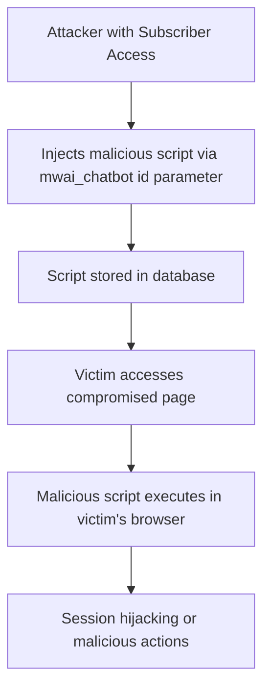

# CVE-2025-5570 - AI Engine WordPress Plugin XSS Vulnerability

## 📋 Executive Summary

**CVE-2025-5570** is a medium-severity stored Cross-Site Scripting (XSS) vulnerability in the AI Engine plugin for WordPress that allows authenticated attackers with subscriber-level privileges to inject malicious scripts via the chatbot shortcode. This vulnerability affects all plugin versions up to and including 2.8.4, potentially compromising user sessions and site security.

---

## 🚨 Quick Facts

| Metric | Details |
|--------|---------|
| **CVE ID** | CVE-2025-5570 |
| **CVSS Score** | 5.4 (Medium) (CNA/Wordfence) |
| **Vulnerability Type** | Stored Cross-Site Scripting (CWE-79) |
| **Attack Vector** | Network |
| **Privileges Required** | Low (Subscriber) |
| **Affected Product** | AI Engine WordPress Plugin |
| **Affected Versions** | ≤ 2.8.4 |
| **Publication Date** | July 8, 2025 |
| **Researcher** | Michael Mazzolini |

---

## 🔍 Technical Details

### Vulnerability Overview

CVE-2025-5570 is a **stored Cross-Site Scripting (XSS)** vulnerability in the AI Engine WordPress plugin that enables authenticated attackers to inject malicious scripts through the `mwai_chatbot` shortcode's `id` parameter . The vulnerability results from insufficient input sanitization and output escaping, allowing injected scripts to be permanently stored and executed whenever users access compromised pages .

### Attack Mechanism



### Technical Root Cause

- **Weakness**: CWE-79 - Improper Neutralization of Input During Web Page Generation 
- **Vulnerable Component**: `mwai_chatbot` shortcode `id` parameter handling
- **Root Cause**: Insufficient input sanitization and output escaping 
- **Impact**: Persistent script execution across user sessions

### Exploitation Requirements

- **Authentication**: Subscriber-level access or higher 
- **Access**: Ability to create or edit content using the mwai_chatbot shortcode
- **Trigger**: Victim visits page containing the compromised shortcode

---

## 📊 Impact Assessment

### Potential Consequences

| Impact Category | Level | Description |
|----------------|-------|-------------|
| **Confidentiality** | 🟡 Low | Potential session cookie theft and unauthorized data access |
| **Integrity** | 🟡 Low | Unauthorized content modification and user interface manipulation |
| **Availability** | 🟢 None | No direct service disruption |

### Attack Scenarios

- **Session Hijacking**: Stealing administrator or user session cookies 
- **Content Manipulation**: Modifying page content displayed to other users
- **Phishing Attacks**: Injecting fake login forms to harvest credentials
- **Malware Distribution**: Serving malicious scripts to site visitors

### CVSS 3.1 Vector Breakdown

- **Attack Vector (AV)**: Network - Exploitable remotely over the network 
- **Attack Complexity (AC)**: Low - No specialized conditions required 
- **Privileges Required (PR)**: Low - Subscriber-level access sufficient 
- **User Interaction (UI)**: Required - Victim must visit compromised page 
- **Scope (S)**: Changed - Can affect components beyond vulnerable plugin 

---

## 🛡️ Mitigation & Response

### Immediate Actions

#### 🔧 Patch Implementation
```bash
# Update AI Engine plugin to version after 2.8.4
# Through WordPress admin dashboard:
# Plugins → Installed Plugins → AI Engine → Update Now
```

#### ⚡ Emergency Workarounds
- **Temporary Disable**: Consider disabling the mwai_chatbot shortcode until patched 
- **Access Restriction**: Limit access to pages using the mwai_chatbot shortcode 
- **Parameter Avoidance**: Avoid using the id parameter in mwai_chatbot shortcodes 

### Security Hardening Recommendations

#### WordPress Configuration
- **User Management**: Review and monitor subscriber-level user accounts
- **Role Permissions**: Implement principle of least privilege for content creation
- **Content Review**: Regular auditing of posts and pages for suspicious content

#### Monitoring & Detection
- **Activity Logging**: Monitor for unusual subscriber activities and shortcode usage
- **Content Scanning**: Regular scans for malicious script patterns in database content
- **User Behavior**: Alert on multiple subscriber registrations from unusual sources

---

## 🔍 Detection & Monitoring

### Indicators of Compromise

#### 🚨 Suspicious Activity Patterns
- Unusual subscriber-level user creating or modifying content
- Unexpected JavaScript code in posts or pages using mwai_chatbot shortcode
- User reports of strange page behavior or unexpected redirects
- Administrative users experiencing session timeouts or hijacking

#### 🔍 Forensic Artifacts
- Modified AI Engine plugin files in versions 2.8.4 and earlier
- Database entries containing suspicious scripts in post content
- WordPress audit logs showing subscribers modifying shortcode parameters

### Security Assessment

- **Plugin Inventory**: Identify affected AI Engine versions (≤ 2.8.4)
- **Content Audit**: Review existing content for malicious script injections
- **User Review**: Audit subscriber-level accounts for unauthorized activities

---

## 📈 Exploitation Status

### Current Threat Landscape

| Aspect | Status |
|--------|---------|
| **Proof of Concept** | Not Publicly Available |
| **Exploit Availability** | No evidence of public exploits |
| **Patch Availability** | Yes (Versions > 2.8.4) |
| **SSVC Exploitation** | None |

### Attack Complexity Assessment

- **Technical Difficulty**: Low - Straightforward exploitation with subscriber access
- **Reliability**: Medium - Requires specific conditions and user interaction
- **Detection Evasion**: Medium - Blends with legitimate user content creation

---

## 🔮 Lessons Learned & Best Practices

### WordPress Security Considerations

#### Secure Development Practices
- **Input Validation**: Implement comprehensive input sanitization for all user-controlled parameters 
- **Output Escaping**: Properly escape all dynamic content rendered in shortcodes and templates 
- **Security Testing**: Conduct thorough security reviews of plugin shortcode implementations
- **Code Review**: Regular security-focused code reviews for WordPress plugin development

#### Organizational Security Measures
- **Update Management**: Establish processes for timely plugin updates and security patches
- **User Management**: Implement strict controls over user registration and role assignments
- **Security Monitoring**: Deploy WordPress-specific security monitoring solutions
- **Backup Strategies**: Maintain regular backups for quick recovery from compromises

### Future Prevention Strategies

- **Security Headers**: Implement Content Security Policy (CSP) headers
- **Plugin Hardening**: Regular security assessments of WordPress plugin ecosystem
- **User Education**: Train content managers on recognizing suspicious activities
- **Vulnerability Scanning**: Automated security scanning for WordPress installations

---

## 📚 References & Resources

### Official Advisories
1. [NVD CVE-2025-5570 Detail](https://nvd.nist.gov/vuln/detail/CVE-2025-5570) 
2. [Wordfence Threat Intelligence](https://www.wordfence.com/threat-intel/vulnerabilities/id/a32dcf96-ec75-46b1-8f1d-608411ad5147?source=cve) 
3. [PT Security Vulnerability Database](https://dbugs.ptsecurity.com/vulnerability/PT-2025-28323) 

### Technical Resources
- [CWE-79: Improper Neutralization of Input During Web Page Generation](https://cwe.mitre.org/data/definitions/79.html)
- [OWASP XSS Prevention Cheat Sheet](https://cheatsheetseries.owasp.org/cheatsheets/Cross_Site_Scripting_Prevention_Cheat_Sheet.html)
- [WordPress Plugin Security Guidelines](https://developer.wordpress.org/plugins/security/)

### Additional Resources
- [CISA Vulnerability Bulletin SB25-195](https://www.cisa.gov/news-events/bulletins/sb25-195) 
- [Feedly CVE Tracking](https://feedly.com/cve/CVE-2025-5570) 

---

## ⚠️ Disclaimer

This document is provided for informational and educational purposes only. The vulnerability has been addressed in AI Engine plugin versions after 2.8.4. Organizations should conduct their own risk assessment and testing before implementing any security measures. Always refer to official security advisories for the most current information.

---

<div align="center">

**Last Updated**: November 2025  
**Status**: ✅ **Patched in versions after 2.8.4**  

</div>
