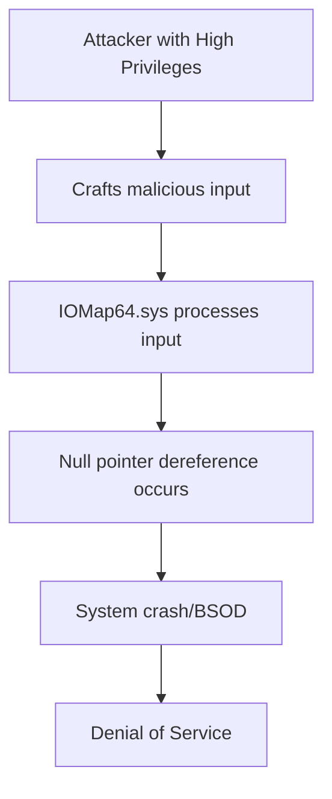

# CVE-2025-6398 - ASUS AI Suite 3 Null Pointer Dereference Vulnerability

## 📋 Executive Summary

**CVE-2025-6398** is a medium-severity null pointer dereference vulnerability in the IOMap64.sys driver of ASUS AI Suite 3 that can lead to system crashes (BSOD) when triggered by specially crafted input. This local privilege vulnerability affects the kernel-level driver and requires high privileges for exploitation, posing denial-of-service risks to systems running vulnerable versions of the ASUS utility software.

---

## 🚨 Quick Facts

| Metric | Details |
|--------|---------|
| **CVE ID** | CVE-2025-6398 |
| **CVSS Score** | 6.7 (Medium) (CNA/ASUS) |
| **Vulnerability Type** | NULL Pointer Dereference (CWE-476)  |
| **Attack Vector** | Local  |
| **Privileges Required** | High  |
| **Affected Product** | ASUS AI Suite 3  |
| **Affected Versions** | < v3.03.42  |
| **Patched Version** | v3.03.42 and later  |
| **Publication Date** | August 1, 2025  |

---

## 🔍 Technical Details

### Vulnerability Overview

CVE-2025-6398 is a **null pointer dereference vulnerability** in the IOMap64.sys driver component of ASUS AI Suite 3, a comprehensive utility software for managing ASUS hardware features including system monitoring, overclocking, and fan control . The vulnerability occurs when the driver processes specially crafted input that leads to dereferencing a null pointer, causing a system crash with a Blue Screen of Death (BSOD) .

### Technical Root Cause

- **Weakness**: CWE-476 - NULL Pointer Dereference 
- **Vulnerable Component**: IOMap64.sys driver in ASUS AI Suite 3 
- **Impact Location**: Kernel-level driver operation 
- **Trigger Mechanism**: Specially crafted input causing null pointer dereference 

### Attack Mechanism



### Exploitation Requirements

- **Privilege Level**: High (administrative or system-level access required) 
- **Access**: Local system access 
- **Complexity**: Low attack complexity 
- **User Interaction**: None required 

---

## 📊 Impact Assessment

### Potential Consequences

| Impact Category | Level | Description |
|----------------|-------|-------------|
| **Availability** | 🔴 High | Complete system crash and denial of service  |
| **Confidentiality** | 🟢 None | No information disclosure  |
| **Integrity** | 🟢 None | No data modification  |

### CVSS v4.0 Vector Breakdown

- **Attack Vector (AV)**: Local - Requires local system access
- **Attack Complexity (AC)**: Low - No specialized conditions required
- **Privileges Required (PR)**: High - Administrative privileges needed
- **User Interaction (UI)**: None - No user interaction required
- **Availability Impact (VA)**: High - Complete system disruption

### Real-World Risk Assessment

- **Exploitation Status**: No known exploits in the wild 
- **Business Impact**: Potential operational disruption and downtime 
- **Data Loss Risk**: Potential data corruption during system crashes 
- **Attack Scenarios**: Primarily insider threats or malware with elevated privileges 

---

## 🛡️ Mitigation & Response

### Immediate Actions

#### 🔧 Patch Implementation
```bash
# Update to patched version
# Download ASUS AI Suite 3 version 3.03.42 or later from official ASUS support
# Verify installation through ASUS control panel or system information
```

#### ⚡ Verification Steps
- Check current AI Suite version in program settings or control panel
- Verify IOMap64.sys driver version and digital signature
- Monitor system stability after update installation

### Security Hardening Recommendations

#### System Security Measures
- **Privilege Management**: Implement principle of least privilege for user accounts 
- **Application Control**: Deploy application whitelisting solutions 
- **Endpoint Protection**: Use security solutions that monitor driver behavior 
- **System Monitoring**: Deploy crash analysis and monitoring tools 

#### Organizational Security
- **Patch Management**: Establish rapid update procedures for system utilities 
- **Vendor Monitoring**: Subscribe to ASUS security advisories for updates 
- **Backup Strategies**: Maintain regular system backups for quick recovery 
- **Security Awareness**: Train administrators on local privilege escalation risks 

### Compensating Controls

- **Software Removal**: Uninstall ASUS AI Suite 3 if not essential for operations 
- **Driver Restrictions**: Implement policies to restrict unauthorized driver loading 
- **System Hardening**: Apply security configurations to limit local attack surfaces 

---

## 🔍 Detection & Monitoring

### Indicators of Compromise

#### 🚨 Suspicious Activity Patterns
- Unexpected system crashes or BSOD events on ASUS systems 
- Unusual driver loading patterns for IOMap64.sys 
- Administrative users executing unusual system utilities 
- Multiple system crash dumps involving kernel drivers 

#### 🔍 Forensic Artifacts
- Crash dump analysis showing IOMap64.sys involvement 
- System logs indicating driver failures or exceptions 
- Unexpected process creation with high privileges 
- Modified or tampered driver files in system directories 

### Security Monitoring Recommendations

- **Crash Analysis**: Implement systematic analysis of system crash dumps 
- **Driver Monitoring**: Deploy tools to monitor driver behavior and integrity 
- **Privilege Auditing**: Regular review of administrative account activities 
- **System Health**: Continuous monitoring of system stability metrics 

---

## 📈 Vulnerability Context

### ASUS Security Ecosystem

This vulnerability is part of a broader security landscape for ASUS system utilities. Recent ASUS advisories have addressed multiple driver-related vulnerabilities in their software ecosystem, including similar issues in Armoury Crate and other system utilities .

### AI/ML Security Context

While CVE-2025-6398 affects AI Suite 3, it's important to distinguish this from AI/ML framework vulnerabilities. This is a traditional software vulnerability in system management tools rather than an AI-specific security issue, contrasting with the prompt injection and model manipulation vulnerabilities affecting AI frameworks .

---

## 🔮 Lessons Learned & Best Practices

### Enterprise Security Considerations

#### Vendor Software Management
- **Security Assessment**: Evaluate third-party system utilities for security risks 
- **Update Policies**: Establish procedures for timely vendor software updates 
- **Alternative Solutions**: Consider using built-in system utilities when possible 
- **Vendor Communication**: Maintain channels for security issue reporting 

#### System Architecture
- **Driver Security**: Implement strict controls for kernel-level components 
- **Privilege Separation**: Isolate system management functions from daily operations 
- **Defense in Depth**: Multiple security layers for critical system components 
- **Recovery Planning**: Comprehensive business continuity for system failures 

### Future Prevention Strategies

- **Code Review**: Vendor implementation of secure coding practices for drivers 
- **Security Testing**: Comprehensive fuzz testing for driver input validation 
- **Architecture Review**: Regular security assessment of system utility design 
- **Industry Collaboration**: Participation in coordinated vulnerability disclosure 

---

## 📚 References & Resources

### Official Advisories
1. [ASUS Security Advisory - CVE-2025-6398](https://www.asus.com/security-advisory/) 
2. [NVD CVE-2025-6398 Detail](https://nvd.nist.gov/vuln/detail/CVE-2025-6398) 
3. [CISA Vulnerability Bulletin SB25-216](https://www.cisa.gov/news-events/bulletins/sb25-216) 

### Technical Analysis
1. [OffSec Radar Technical Analysis](https://radar.offseq.com/threat/cve-2025-6398-cwe-476-null-pointer-dereference-in--e2e3f3a6) 
2. [Feedly ASUS Vulnerability Tracking](https://feedly.com/cve/vendors/asus) 

### Additional Resources
- [CWE-476: NULL Pointer Dereference](https://cwe.mitre.org/data/definitions/476.html)
- [ASUS Product Support Portal](https://www.asus.com/support/)

---

## ⚠️ Disclaimer

This document is provided for informational and educational purposes only. The vulnerability has been addressed in ASUS AI Suite 3 version 3.03.42 and later. Organizations should conduct their own risk assessment and testing before implementing any security measures. Always refer to official ASUS security advisories for the most current information.

---

<div align="center">

**Last Updated**: November 2025  
**Status**: ✅ **Patched in version 3.03.42**  

</div>
