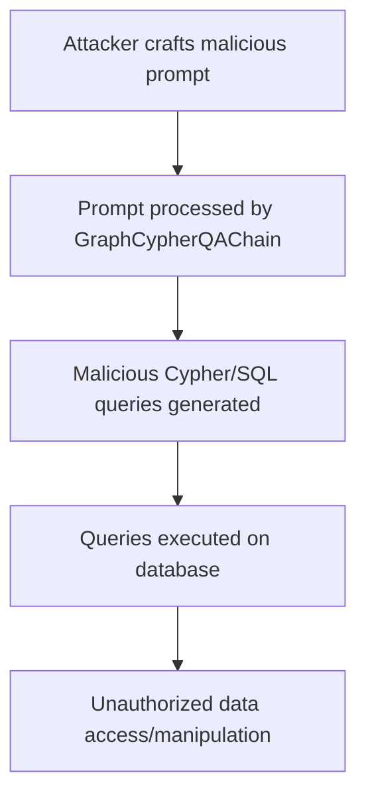

# CVE-2024-8309 - Technical Analysis

## 📋 Executive Summary

**CVE-2024-8309**, discovered in the Langchain framework, is a significant **SQL injection vulnerability** in the `GraphCypherQAChain` class. This vulnerability allows attackers to execute arbitrary Cypher/SQL commands through crafted prompt injections, potentially leading to full database compromise.

---

## 🚨 Quick Facts

| Metric | Details |
|--------|---------|
| **CVE ID** | CVE-2024-8309 |
| **Common Name** | Langchain SQL Injection |
| **CVSS Score** | 9.8 (Critical) (NIST/NVD) |
| **Vulnerability Type** | SQL Injection (CWE-89)  |
| **Attack Vector** | Network |
| **User Interaction** | None |
| **Affected Product** | Langchain `GraphCypherQAChain` |
| **Publication Date** | October 29, 2024  |

---

## 🔍 Technical Details

### Vulnerability Classification
- **CWE**: 89 - Improper Neutralization of Special Elements used in an SQL Command
- **CWE**: 74 - Improper Neutralization of Special Elements in Output Used by a Downstream Component
- **Attack Complexity**: Low 
- **Privileges Required**: None 
- **Scope**: Unchanged 

### Affected Components

| Package | Affected Versions | Patched Versions |
|---------|-------------------|------------------|
| **langchain** | < 0.2.0 | 0.2.0  |
| **langchain-community** | >= 0.2.0, < 0.2.19 | 0.2.19  |
| **langchain-ai/langchain** | 0.2.5 | 0.3.0  |

### Attack Mechanism

The vulnerability exploits the `GraphCypherQAChain` class in Langchain, where **prompt injection** can lead to full **SQL injection** compromise. The attack flow:



### Exploitation Impact

- 🔓 **Unauthorized Data Manipulation**: Create, update, or delete database nodes and relationships 
- 📤 **Data Exfiltration**: Extract sensitive information from the database 
- 🚫 **Denial of Service**: Delete all data to disrupt services 
- 🏢 **Multi-tenant Breaches**: Access data across different tenants 
- ⚠️ **Data Integrity Issues**: Compromise database integrity 

---

## 📊 Impact Assessment

### Severity Metrics

| Impact Category | Level | Description |
|----------------|-------|-------------|
| **Confidentiality** | 🔴 High | Complete information disclosure  |
| **Integrity** | 🔴 High | Total compromise of data integrity  |
| **Availability** | 🔴 High | Full service disruption possible  |

### CVSS 3.1 Vector Breakdown
- **Attack Vector**: Network (AV:N) 
- **Privileges Required**: None (PR:N) 
- **User Interaction**: None (UI:N) 
- **Scope**: Unchanged (S:U) 

---

## 🛡️ Mitigation & Response

### Immediate Actions

#### 🔧 Patch Implementation
```bash
# Update langchain package
pip install --upgrade langchain>=0.2.0

# Update langchain-community package  
pip install --upgrade langchain-community>=0.2.19
```

#### 🚨 Temporary Workarounds
- **Input Validation**: Implement strict input sanitization for user-provided prompts 
- **Access Controls**: Apply least privilege principles to database accounts 
- **Query Sanitization**: Use parameterized queries and prepared statements 
- **Audit Logging**: Monitor and log all database operations 

### Security Hardening

#### Configuration Recommendations
- **Database Permissions**: Restrict application database user to minimum required privileges
- **Prompt Validation**: Implement strict whitelisting for allowed prompt patterns
- **Network Security**: Isolate database servers from direct external access
- **Monitoring**: Deploy anomaly detection for unusual query patterns

#### Code-Level Protections
```python
# Example input validation
def validate_cypher_query(user_input):
    # Implement strict validation logic
    allowed_patterns = [r'^MATCH\s+.*$', r'^RETURN\s+.*$']  # Simple example
    for pattern in allowed_patterns:
        if re.match(pattern, user_input, re.IGNORECASE):
            return True
    return False
```

---

## 📈 Exploitation Status

### Current Threat Landscape
- **Proof of Concept**: Available through huntr.com 
- **Exploit Availability**: Public exploits exist 
- **EPSS Score**: 0.04% (as of October 30, 2024) 

### Detection Methods
- **Query Monitoring**: Detect unusual Cypher/SQL query patterns
- **Behavioral Analysis**: Monitor for abnormal database access patterns
- **Log Analysis**: Review application logs for injection attempts

---

## 🔮 Security Recommendations

### For Developers
- **Immediate Patching**: Update to patched versions without delay
- **Security Testing**: Conduct thorough penetration testing
- **Code Review**: Audit all uses of GraphCypherQAChain
- **Dependency Management**: Implement automated security updates

### For Security Teams
- **Vulnerability Scanning**: Include Langchain components in security scans
- **Incident Response**: Prepare detection rules for exploitation attempts
- **Threat Intelligence**: Monitor for new exploitation techniques

### Long-term Strategies
- **Secure Coding Training**: Educate developers on prompt injection risks
- **Architecture Review**: Implement additional security layers for AI components
- **Continuous Monitoring**: Deploy runtime application security protection

---

## 📚 References & Resources

### Official Advisories
1. [GitHub Security Advisory - GHSA-45pg-36p6-83v9](https://github.com/advisories/GHSA-45pg-36p6-83v9) 
2. [NVD CVE-2024-8309 Detail](https://nvd.nist.gov/vuln/detail/CVE-2024-8309) 
3. [huntr Bounty Report](https://huntr.com/bounties/8f4ad910-7fdc-4089-8f0a-b5df5f32e7c5) 

### Technical Resources
- **Patch Commit**: [GitHub Fix Commit](https://github.com/langchain-ai/langchain/commit/c2a3021bb0c5f54649d380b42a0684ca5778c255) 
- **EPSS Scoring**: [FIRST EPSS Database](https://www.first.org/epss/)

### Community Resources
- **OWASP LLM Security Top 10**: Framework for AI/LLM security
- **Langchain Security Documentation**: Official security guidelines

---

## ⚠️ Disclaimer

This document provides security information for educational and defensive purposes. Organizations should conduct their own risk assessment and testing before implementing any security measures. Always refer to official security advisories for the most current information.

---

<div align="center">

**Last Updated**: November 2024  
**Status**: 🟠 **Patch Available - Immediate Action Required**

</div>
