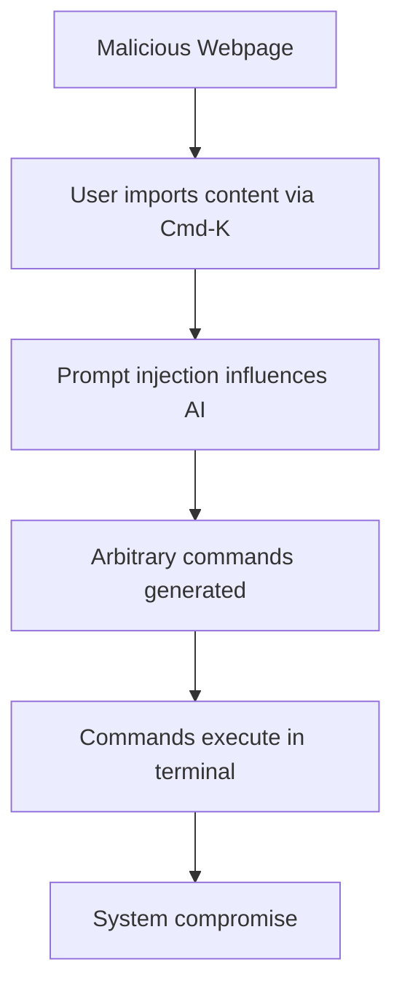

# CVE-2024-48919 - Cursor AI Terminal Command Injection Vulnerability

## 📋 Executive Summary

**CVE-2024-48919** is a critical remote code execution vulnerability in the Cursor AI code editor that allowed prompt injection attacks through the Terminal Cmd-K feature. This vulnerability enabled attackers to execute arbitrary commands on users' systems by manipulating AI-generated terminal commands through malicious web content.

---

## 🚨 Quick Facts

| Metric | Details |
|--------|---------|
| **CVE ID** | CVE-2024-48919 |
| **CVSS Score** | 9.2 (Critical) (CNA/GitHub,Inc.) |
| **Vulnerability Type** | Improper Input Validation (CWE-20) |
| **Attack Vector** | Network |
| **User Interaction** | None |
| **Affected Product** | Cursor AI Code Editor |
| **Affected Versions** | < 0.42 |
| **Patched Version** | 0.42 |
| **Publication Date** | October 22, 2024 |
| **Exploit Status** | No Public Exploits |

---

## 🔍 Technical Details

### Vulnerability Overview

CVE-2024-48919 was a **critical prompt injection vulnerability** in Cursor's AI-powered Terminal Cmd-K/Ctrl-K feature that allowed remote command execution through compromised web content . The vulnerability exploited the AI model's inability to properly validate and sanitize malicious prompt injections from external web sources.

### Attack Mechanism



### Technical Root Cause

- **Weakness**: CWE-20 - Improper Input Validation 
- **Vulnerable Component**: Terminal Cmd-K/Ctrl-K AI feature
- **Attack Vector**: Network-based prompt injection through web content
- **Impact**: Arbitrary command execution with user privileges

### Exploitation Requirements

Successful exploitation required specific preconditions:
- **User Action**: Explicit import of malicious web content into Terminal Cmd-K prompt 
- **Attacker Control**: Compromised webpage containing prompt injection payload
- **Feature Usage**: Active use of Cursor's AI terminal command generation

---

## 📊 Impact Assessment

### Potential Consequences

| Impact Category | Level | Description |
|----------------|-------|-------------|
| **Confidentiality** | 🔴 High | Complete system access and data exfiltration |
| **Integrity** | 🔴 High | Unauthorized system modifications and data tampering |
| **Availability** | 🔴 High | Service disruption and denial of service |

### Attack Scenarios

- **System Takeover**: Full control over affected development workstations 
- **Data Theft**: Exfiltration of source code, credentials, and sensitive data
- **Supply Chain Attacks**: Compromise of development environments and build systems
- **Lateral Movement**: Using compromised developer systems to attack internal networks

### CVSS 4.0 Vector Breakdown

- **Attack Vector (AV)**: Network - exploitable remotely over network
- **Attack Complexity (AC)**: Low - no specialized conditions required
- **Privileges Required (PR)**: None - no authentication needed
- **User Interaction (UI)**: None - automatic after initial user action
- **Scope (S)**: Changed - can affect components beyond vulnerable application

---

## 🛡️ Mitigation & Response

### Immediate Actions

#### 🔧 Patch Implementation
```bash
# Update to patched version
# Cursor 0.42 includes comprehensive client-side fixes
```

#### ✅ Verification Steps
- Verify Cursor version in application settings (≥ 0.42)
- Check that server-side patches are active (deployed September 27, 2024)
- Validate that terminal command streaming properly filters control characters

### Security Hardening

#### Configuration Recommendations
- **Enable Preview Box**: Set `"cursor.terminal.usePreviewBox": true` in settings 
- **Content Validation**: Only include trusted web content in AI prompts
- **Network Security**: Implement content security policies for development environments

#### Best Practices
- **Principle of Least Privilege**: Run Cursor with minimal necessary permissions
- **Monitoring**: Deploy endpoint detection for unusual terminal activity
- **Education**: Train developers on AI tool security risks and prompt injection

### Patch Information

**Timeline**:
- **September 27, 2024**: Server-side patch deployed within 2 hours of report 
- **Cursor 0.42**: Client-side mitigations including control character filtering 

**Fix Details**:
- **Server-side**: Prevention of newline and control character streaming 
- **Client-side**: Additional input validation and preview mechanisms
- **Optional Security**: Manual acceptance requirement for generated commands

---

## 🔍 Detection & Monitoring

### Indicators of Compromise

#### 🚨 Suspicious Activity Patterns
- Unexpected terminal command execution from Cursor AI features
- Unusual network connections originating from development workstations
- Anomalous process creation patterns following Cursor terminal usage
- Modified or new files in project directories without clear developer intent

#### 🔍 Security Monitoring
- **Process Monitoring**: Detect unusual command execution from editor context
- **Network Analysis**: Identify suspicious outbound connections from dev systems
- **File Integrity**: Monitor critical system and project files for unauthorized changes

### Security Assessment

- **Exploitation Status**: No evidence of active exploitation 
- **Proof of Concept**: No public exploits available 
- **EPSS Score**: 0.35% probability of exploitation 

---

## 🔮 Lessons Learned & Best Practices

### AI Security Considerations

#### Secure Development Practices
- **Input Validation**: Rigorous sanitization of all AI model inputs and outputs 
- **Output Filtering**: Comprehensive filtering of control characters and special sequences
- **User Controls**: Manual approval mechanisms for AI-generated executable content

#### Organizational Security
- **Vendor Security Assessment**: Evaluate AI tool security postures before adoption
- **Update Management**: Establish rapid update procedures for critical development tools
- **Security Training**: Developer education on AI-specific security risks

### Future Prevention Strategies

- **Defense in Depth**: Multiple validation layers for AI-generated content
- **Zero Trust**: Assume AI outputs are untrusted until validated
- **Continuous Monitoring**: Real-time detection of prompt injection attempts

---

## 📚 References & Resources

### Official Advisories
1. [GitHub Security Advisory - GHSA-rmj9-23rg-gr67](https://github.com/getcursor/cursor/security/advisories/GHSA-rmj9-23rg-gr67) 
2. [NVD CVE-2024-48919 Detail](https://nvd.nist.gov/vuln/detail/CVE-2024-48919) 

### Technical Analysis
1. [Feedly Security Analysis](https://feedly.com/cve/CVE-2024-48919) 
2. [OpenCVE Vulnerability Tracking](https://app.opencve.io/cve/CVE-2024-48919) 

### Additional Resources
- [CWE-20: Improper Input Validation](https://cwe.mitre.org/data/definitions/20.html)
- [AI Security Best Practices](https://learnprompting.org/docs/category/-security)

---

## ⚠️ Disclaimer

This document is provided for informational and educational purposes only. The vulnerability has been addressed in Cursor version 0.42 and through server-side patches deployed on September 27, 2024. Organizations should conduct their own risk assessment and testing before implementing any security measures. Always refer to official security advisories for the most current information.

---

<div align="center">

**Last Updated**: October 2024  
**Status**: ✅ **Patched in version 0.42**  

</div>
