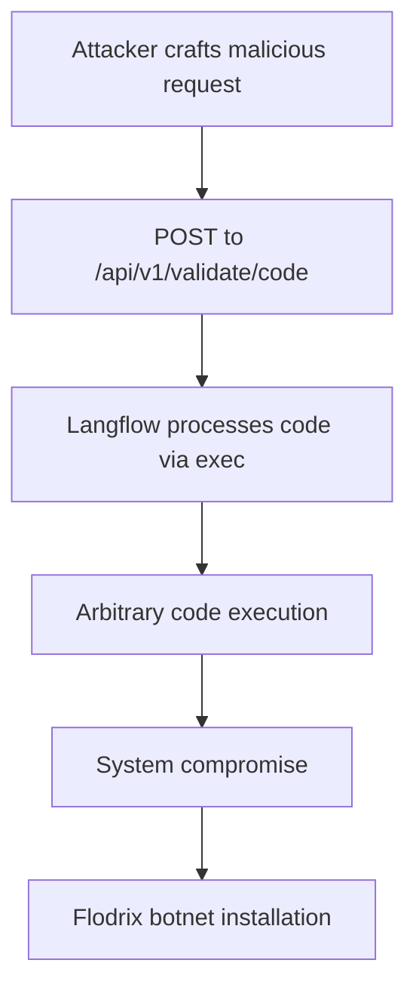

# CVE-2025-3248 - Langflow Unauthenticated Remote Code Execution Vulnerability

## 📋 Executive Summary

**CVE-2025-3248** is a critical unauthenticated remote code execution vulnerability in Langflow, a popular open-source visual framework for building AI applications. This vulnerability allows attackers to execute arbitrary Python code on vulnerable servers without any authentication, leading to complete system compromise. With a CVSS score of 9.8 and active exploitation in the wild, this vulnerability poses significant risk to organizations using Langflow for AI development workflows.

---

## 🚨 Quick Facts

| Metric | Details |
|--------|---------|
| **CVE ID** | CVE-2025-3248 |
| **CVSS Score** | 9.8 (Critical) (CNA/VulnCheck) |
| **Vulnerability Type** | Code Injection (CWE-94) & Missing Authentication (CWE-306) |
| **Attack Vector** | Network |
| **User Interaction** | None |
| **Affected Product** | Langflow AI Framework |
| **Affected Versions** | < 1.3.0 |
| **Patched Version** | 1.3.0 |
| **Exploitation Status** | Actively Exploited |
| **CISA KEV Catalog** | Added May 5, 2025 |

---

## 🔍 Technical Details

### Vulnerability Overview

CVE-2025-3248 is a critical security flaw in Langflow's code validation endpoint that allows unauthenticated remote code execution. The vulnerability exists in the `/api/v1/validate/code` endpoint, which processes user-supplied Python code without proper authentication or sandboxing.

### Attack Mechanism



### Technical Root Cause

The vulnerability stems from two critical failures in Langflow's design:

1. **Missing Authentication**: The `/api/v1/validate/code` endpoint requires no authentication, allowing unrestricted access
2. **Unsafe Code Execution**: User input is directly passed to Python's `exec()` function without proper sanitization or sandboxing

The vulnerable code path involves:
- User code parsed into Abstract Syntax Tree (AST) using `ast.parse()`
- Compilation to bytecode via `compile()` function
- Direct execution using `exec()` with no security controls

### Exploitation Techniques

Attackers can embed malicious payloads in two primary ways:

#### 1. **Decorator-based Injection**
```python
@exec("import os; os.system('malicious command')")
def foo():
    pass
```

#### 2. **Default Argument Injection**
```python
def foo(cmd=exec("__import__('os').system('id > /tmp/pwned')")):
    pass
```

When Langflow processes these payloads, the embedded code executes immediately during AST processing, before any validation occurs.

---

## 📊 Impact Assessment

### Potential Consequences

| Impact Category | Level | Description |
|----------------|-------|-------------|
| **Confidentiality** | 🔴 High | Complete system access and data exfiltration |
| **Integrity** | 🔴 High | Unauthorized data modification and system compromise |
| **Availability** | 🔴 High | Service disruption and denial of service |

### Real-World Exploitation

**Active Botnet Campaign**: Threat actors are actively exploiting CVE-2025-3248 to deploy the Flodrix botnet. The attack chain involves:

1. **Reconnaissance**: Scanning for exposed Langflow instances using tools like Shodan
2. **Initial Compromise**: Using public PoC exploits to gain initial access
3. **Payload Delivery**: Downloading and executing malware loader scripts
4. **Persistence**: Establishing reverse shells for maintained access

**AI System Manipulation**: Attackers can modify AI agent system prompts to inject backdoors into generated code, potentially compromising entire development pipelines.

### CVSS 3.1 Vector Breakdown
- **Attack Vector (AV)**: Network - Exploitable remotely over the network
- **Privileges Required (PR)**: None - No authentication needed
- **User Interaction (UI)**: None - Zero-click exploitation
- **Scope (S)**: Unchanged - Affects only the vulnerable component

---

## 🛡️ Mitigation & Response

### Immediate Actions

#### 🔧 **Patch Implementation**
```bash
# Upgrade to patched version
pip install --upgrade langflow>=1.3.0

# Verify installation
pip show langflow
```

#### 🚨 **Emergency Workarounds**
- **Network Segmentation**: Immediately restrict network access to Langflow instances
- **Endpoint Protection**: Deploy WAF rules to block requests to `/api/v1/validate/code`
- **Access Controls**: Implement reverse proxy authentication for all API endpoints

### Security Hardening

#### Configuration Recommendations
```yaml
# Example network policy for Kubernetes deployments
apiVersion: networking.k8s.io/v1
kind: NetworkPolicy
metadata:
  name: langflow-restrictive
spec:
  podSelector:
    matchLabels:
      app: langflow
  policyTypes:
  - Ingress
  - Egress
  ingress:
  - from: []  # Default deny all
  egress:
  - to:
    - ports:  # Allow only essential outbound
      - protocol: TCP
        port: 443
      - protocol: TCP
        port: 80
```

#### Monitoring & Detection
- **Log Analysis**: Monitor for exceptions in Langflow logs containing command output
- **Network Monitoring**: Detect reverse shell connections on unusual ports
- **File Integrity**: Monitor for unauthorized changes to Langflow configuration and database files

### Comprehensive Protection Strategy

1. **Runtime Protection**: Deploy application security monitoring that detects exploitation attempts
2. **Vulnerability Management**: Continuously scan for vulnerable Langflow versions
3. **Security Posture Management**: Identify and remediate misconfigurations that enable attack propagation

---

## 🔍 Detection & Monitoring

### Indicators of Compromise

#### 🚨 **Suspicious Activity Patterns**
- Unauthorized processes spawned from Langflow services
- Unexpected outgoing network connections from Langflow instances
- Modifications to Langflow's SQLite database or system prompts
- Reverse shell connections on non-standard ports

#### 🔍 **Detection Signatures**
```python
# Monitor for exploitation patterns in logs
"POST /api/v1/validate/code" AND ("exec" OR "subprocess" OR "os.system")
```

### Security Monitoring Recommendations

- **Application Logging**: Enhanced logging for all code validation requests and responses
- **Process Monitoring**: Audit child process creation from Langflow services
- **Network Security**: Detect and block unexpected outbound connections
- **Database Monitoring**: Alert on unauthorized access to Langflow configuration data

---

## 📈 Exploitation Status

### Current Threat Landscape

| Aspect | Status |
|--------|---------|
| **Active Exploitation** | Confirmed in Wild |
| **Proof of Concept** | Publicly Available |
| **Malware Association** | Flodrix Botnet |
| **CISA KEV Status** | Listed - Required Action |

### Attack Complexity Assessment
- **Technical Difficulty**: Low - Public exploits available
- **Reliability**: High - Consistent exploitation with crafted payloads
- **Detection Evasion**: Medium - Requires log analysis for detection

---

## 🔮 Lessons Learned & Best Practices

### AI Security Considerations

#### Secure Development Practices
- **Zero Trust for AI APIs**: Implement authentication for all endpoints, especially code execution features
- **Input Validation**: Never trust user-supplied code without rigorous validation and sandboxing
- **Safe Execution Environments**: Use containerization or serverless functions for code execution isolation

#### Organizational Security Measures
- **Supply Chain Security**: Implement rigorous security reviews for AI framework dependencies
- **Incident Response**: Prepare procedures for AI system compromises and model manipulation
- **Security Training**: Educate developers on prompt injection and AI system security risks

### Future Prevention Strategies

- **Architecture Review**: Implement additional security layers for AI components
- **Continuous Monitoring**: Deploy runtime application security protection
- **Compliance Alignment**: Follow CIS benchmarks and security best practices for container deployments

---

## 📚 References & Resources

### Official Advisories
1. [CISA Known Exploited Vulnerabilities Catalog - CVE-2025-3248](https://www.cisa.gov/known-exploited-vulnerabilities-catalog?field_cve=CVE-2025-3248)
2. [GitHub Security Advisory - GHSA-c995-4fw3-j39m](https://github.com/advisories/GHSA-c995-4fw3-j39m)
3. [NVD CVE-2025-3248 Detail](https://nvd.nist.gov/vuln/detail/CVE-2025-3248)

### Technical Analysis
1. [Trend Micro Research - Flodrix Botnet Campaign](https://www.trendmicro.com/en_us/research/25/f/langflow-vulnerability-flodric-botnet.html)
2. [OffSec Technical Breakdown](https://www.offsec.com/blog/cve-2025-3248/)
3. [Zscaler ThreatLabz Research](https://www.zscaler.com/blogs/security-research/cve-2025-3248-rce-vulnerability-langflow)

### Protection Resources
- [Dynatrace Application Security Guidance](https://www.dynatrace.com/news/blog/remediating-cve-2025-3248-how-dynatrace-application-security-protects-agentic-ai-applications/)
- [Network Security Configuration Examples](https://feedly.com/cve/CVE-2025-3248)

---

## ⚠️ Disclaimer

This document is provided for informational and educational purposes only. The vulnerability has been addressed in Langflow version 1.3.0 and later. Organizations should conduct their own risk assessment and testing before implementing any security measures. Always refer to official security advisories for the most current information.

---

<div align="center">

**Last Updated**: November 2024  
**Status**: 🔴 **CRITICAL - Immediate Patching Required**  

</div>
