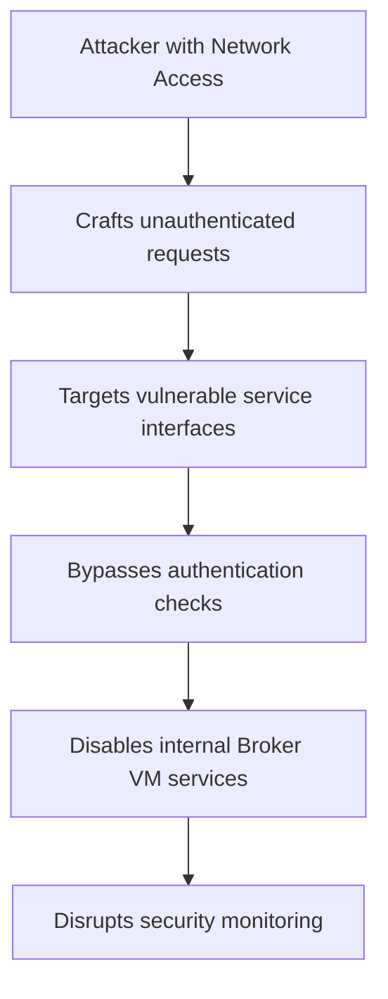

# CVE-2025-0132 - Cortex XDR Broker VM Authentication Bypass Vulnerability

## 📋 Executive Summary

**CVE-2025-0132** is a security vulnerability in Palo Alto Networks Cortex XDR Broker VM that allows unauthenticated attackers with network access to disable critical internal services. This missing authentication flaw poses a significant risk to the integrity and availability of the security monitoring infrastructure.

---

## 🚨 Quick Facts

| Metric | Details |
|--------|---------|
| **CVE ID** | CVE-2025-0132 |
| **CVSS Score** | 6.9 (Medium) (CNA/Palo Alto Networks,Inc.) |
| **Vulnerability Type** | Missing Authentication (CWE-306)  |
| **Attack Vector** | Network  |
| **User Interaction** | None  |
| **Affected Product** | Cortex XDR Broker VM  |
| **Affected Versions** | 26.0.0 to <26.0.119  |
| **Patched Version** | 26.0.119  |
| **Publication Date** | May 14, 2025  |

---

## 🔍 Technical Details

### Vulnerability Overview

CVE-2025-0132 is a **missing authentication vulnerability** (CWE-306) in Palo Alto Networks Cortex XDR Broker VM that enables unauthenticated attackers to disable critical internal services . The vulnerability stems from insufficient access controls on service management interfaces, allowing complete bypass of authentication requirements.

### Attack Mechanism



### Technical Root Cause

- **Weakness**: CWE-306 - Missing Authentication for Critical Function 
- **Vulnerable Component**: Internal service management interfaces 
- **Impact**: Service disruption and potential loss of security visibility 

### Exploitation Requirements

- **Network Access**: Attacker must have network connectivity to the Broker VM 
- **Privileges**: No authentication required 
- **Complexity**: Low attack complexity 

---

## 📊 Impact Assessment

### Potential Consequences

| Impact Category | Level | Description |
|----------------|-------|-------------|
| **Availability** | 🟡 Low | Service disruption of internal Broker VM services  |
| **Integrity** | 🟡 Low | Unauthorized modification of service states  |
| **Confidentiality** | 🟢 None | No information disclosure  |

### Business Impact

- **Security Monitoring Disruption**: Potential compromise of endpoint detection and response capabilities 
- **Service Availability**: Unauthorized disruption of critical security infrastructure 
- **Operational Impact**: Potential gaps in security visibility and incident response 

### CVSS Vector Analysis

**CVSS v4.0: 6.9 Medium** 
- **Attack Vector**: Network - exploitable remotely over network
- **Privileges Required**: None - no authentication needed
- **User Interaction**: None - no user interaction required

**CVSS v3.x: 7.5 High** 
- Higher scoring in v3.x reflects different weighting methodology

---

## 🛡️ Mitigation & Response

### Immediate Actions

#### 🔧 Patch Implementation
```bash
# Upgrade to patched version
# Fixed in Cortex XDR Broker VM 26.0.119 and later versions 
```

#### ✅ Verification Steps
- Check current Broker VM version in administration console
- Verify automatic updates are enabled for future protection 
- Monitor for any service disruption during update process

### Security Recommendations

#### Network Security Measures
- **Access Control**: Restrict network access to Broker VM management interfaces 
- **Segmentation**: Implement network segmentation for security infrastructure 
- **Monitoring**: Deploy additional monitoring for authentication bypass attempts

#### Organizational Security
- **Update Policy**: Enable automatic upgrades for Broker VM 
- **Assessment**: Conduct security review of service authentication mechanisms
- **Documentation**: Maintain inventory of Broker VM deployments and versions

### Patch Information

**Fixed Version**: Cortex XDR Broker VM 26.0.119 

**Update Recommendation**:
- Enable automatic upgrades for continuous protection 
- Manual update required if automatic upgrades are disabled 

---

## 🔍 Detection & Monitoring

### Indicators of Compromise

#### 🚨 Suspicious Activity Patterns
- Unauthenticated requests to Broker VM service interfaces
- Unexpected service termination or disablement
- Authentication log anomalies or missing authentication events

#### 🔍 Security Monitoring
- **Service Health**: Monitor for unexpected service disruptions
- **Access Logs**: Review logs for unauthenticated management requests
- **Network Traffic**: Detect unusual patterns to Broker VM management ports

### Security Assessment

- **Exploitation Status**: No evidence of malicious exploitation 
- **EPSS Score**: 0.1% probability of exploitation 
- **Public Exploits**: No known public exploits 

---

## 📈 Vulnerability Context

### Discovery Information

- **Researchers**: Bartosz Chałek and Piotr Kozowicz of CERT Team at ING Bank Slaski 
- **Discovery Method**: External security research 
- **Vendor Coordination**: Responsible disclosure through Palo Alto Networks 

### Enterprise Security Implications

This vulnerability affects a critical component of the Cortex XDR security platform, which is widely deployed in enterprise environments for endpoint protection and threat detection. The Broker VM serves as a crucial integration point between endpoints and the central management console.

---

## 🔮 Lessons Learned & Best Practices

### Security Architecture

#### Authentication Design
- **Zero Trust Principles**: Implement authentication for all service management functions 
- **Defense in Depth**: Multiple authentication layers for critical infrastructure
- **API Security**: Comprehensive security testing of all management interfaces

#### Infrastructure Protection
- **Network Security**: Strict access controls for security management networks
- **Update Management**: Automated patch deployment for security components
- **Monitoring**: Comprehensive logging and alerting for security infrastructure

### Organizational Security Measures

- **Third-Party Assessment**: Regular security testing of critical security platforms
- **Vendor Management**: Establish processes for tracking security advisories
- **Incident Response**: Prepare procedures for security platform compromises

---

## 📚 References & Resources

### Official Advisories
1. [Palo Alto Networks Security Advisory - CVE-2025-0132](https://security.paloaltonetworks.com/CVE-2025-0132) 
2. [NVD CVE-2025-0132 Detail](https://nvd.nist.gov/vuln/detail/CVE-2025-0132) 

### Technical Resources
- [CWE-306: Missing Authentication for Critical Function](https://cwe.mitre.org/data/definitions/306.html)
- [Cortex XDR Documentation](https://docs.paloaltonetworks.com/cortex/cortex-xdr)

### Additional Resources
- [Tenable Vulnerability Database](https://www.tenable.com/cve/CVE-2025-0132) 
- [OpenCVE Vulnerability Tracking](https://app.opencve.io/cve/CVE-2025-0132) 

---

## ⚠️ Disclaimer

This document is provided for informational and educational purposes only. The vulnerability has been addressed in Cortex XDR Broker VM version 26.0.119 and later. Organizations should conduct their own risk assessment and testing before implementing any security measures. Always refer to official Palo Alto Networks security advisories for the most current information.

---

<div align="center">

**Last Updated**: May 2025  
**Status**: ✅ **Patched in version 26.0.119**  

</div>
