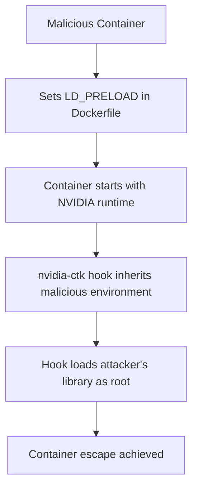

# CVE-2025-23266 (NVIDIAScape) - NVIDIA Container Toolkit Container Escape Vulnerability

## 📋 Executive Summary

**CVE-2025-23266**, known as **NVIDIAScape**, is a critical container escape vulnerability in the NVIDIA Container Toolkit that allows attackers to break out of container isolation and gain full root access to the host machine. With a CVSS score of 9.0 (Critical), this vulnerability poses significant risks to AI/ML workloads, cloud GPU services, and multi-tenant container environments using NVIDIA GPU acceleration.

---

## 🚨 Quick Facts

| Metric | Details |
|--------|---------|
| **CVE ID** | CVE-2025-23266 |
| **Common Name** | NVIDIAScape |
| **CVSS Score** | 9.0 (Critical) (CNA/NVIDIA Corporation) |
| **Vulnerability Type** | Untrusted Search Path (CWE-426) |
| **Attack Vector** | Adjacent Network |
| **User Interaction** | None |
| **Affected Product** | NVIDIA Container Toolkit |
| **Affected Versions** | ≤ 1.17.7 |
| **Patched Version** | 1.17.8 |
| **Publication Date** | July 17, 2025 |

---

## 🔍 Technical Details

### Vulnerability Overview

CVE-2025-23266 is a critical **container escape vulnerability** in the NVIDIA Container Toolkit's OCI (Open Container Initiative) hook mechanism. The vulnerability allows malicious containers to break isolation boundaries and execute arbitrary code with root privileges on the host system through environment variable manipulation in the `enable-cuda-compat` hook .

### Attack Mechanism



### Technical Root Cause

The vulnerability stems from the `createContainer` OCI hook in the NVIDIA Container Toolkit inheriting environment variables from the container image without proper sanitization . Specifically:

- **Weakness**: CWE-426 - Untrusted Search Path
- **Vulnerable Component**: `enable-cuda-compat` hook in NVIDIA Container Toolkit
- **Exploitation Vector**: `LD_PRELOAD` environment variable inheritance
- **Impact**: Privileged code execution on host system

### Exploitation Requirements

- **Container Execution**: Ability to run containers with NVIDIA runtime
- **GPU Access**: Access to GPU resources via NVIDIA Container Toolkit
- **Network Access**: Adjacent network access (AV:A)
- **Privileges**: Low privileges in container (PR:L)

### Proof of Concept

The exploit requires only a simple three-line Dockerfile :

```dockerfile
FROM busybox
ENV LD_PRELOAD=/proc/self/cwd/poc.so
ADD poc.so /
```

When this container runs on a vulnerable host, the `nvidia-ctk` hook inherits the `LD_PRELOAD` variable and loads the attacker's malicious library with root privileges, achieving container escape.

---

## 📊 Impact Assessment

### Potential Consequences

| Impact Category | Level | Description |
|----------------|-------|-------------|
| **Confidentiality** | 🔴 High | Complete host system access and data exfiltration |
| **Integrity** | 🔴 High | Unauthorized system modification and data tampering |
| **Availability** | 🔴 High | Service disruption and denial of service |

### Attack Scenarios

- **Multi-tenant Breaches**: Cross-tenant data access in cloud GPU services 
- **AI Model Theft**: Exfiltration of proprietary machine learning models
- **Supply Chain Attacks**: Compromise of AI/ML development pipelines
- **Infrastructure Takeover**: Full root control over host systems

### CVSS 3.1 Vector Breakdown

- **Attack Vector (AV)**: Adjacent Network - Exploitable from adjacent network
- **Attack Complexity (AC)**: Low - No specialized conditions required
- **Privileges Required (PR)**: Low - Low privileges in container sufficient
- **User Interaction (UI)**: None - No user interaction required
- **Scope (S)**: Changed - Can affect components beyond container

---

## 🛡️ Mitigation & Response

### Immediate Actions

#### 🔧 Patch Implementation
```bash
# Upgrade to patched version
# Ubuntu/RHEL systems
apt/yum update nvidia-container-toolkit

# Kubernetes with GPU Operator
helm upgrade gpu-operator nvidia/gpu-operator \
    --set toolkit.version=v1.17.8-ubuntu20.04
```

#### ⚡ Emergency Workarounds
- **Hook Disable**: Set `disable-cuda-compat-lib-hook = true` in `/etc/nvidia-container-toolkit/config.toml` 
- **Access Control**: Restrict execution of untrusted container images
- **Network Segmentation**: Implement strict network controls for container environments

### Security Hardening

#### Configuration Recommendations
- **Runtime Protection**: Deploy eBPF-based security monitoring for hook activities 
- **Image Security**: Implement container image signing and verification
- **Access Management**: Apply principle of least privilege for container deployments

#### Cloud Service Protections
- **VM Isolation**: Leverage virtualization boundaries in managed Kubernetes services 
- **Tenant Separation**: Ensure proper isolation in multi-tenant GPU environments
- **Monitoring**: Deploy anomaly detection for container escape attempts

### Patch Information

**Fixed Versions** :
- **NVIDIA Container Toolkit**: ≥ 1.17.8
- **NVIDIA GPU Operator**: ≥ 25.3.1

**Affected Versions**:
- **NVIDIA Container Toolkit**: ≤ 1.17.7 (CDI mode only for versions prior to 1.17.5)
- **NVIDIA GPU Operator**: ≤ 25.3.0

---

## 🔍 Detection & Monitoring

### Indicators of Compromise

#### 🚨 Suspicious Activity Patterns
- Unusual `nvidia-ctk` process behavior and library loading
- Unexpected container-to-host privilege escalation attempts
- Anomalous network connections from container hosts
- Unauthorized access to host resources from container contexts

#### 🔍 Detection Strategies
- **Process Monitoring**: Detect unusual `LD_PRELOAD` usage in hook processes 
- **File Integrity**: Monitor critical host system files for unauthorized changes
- **Network Analysis**: Identify suspicious container-host communication patterns

### Security Assessment

- **Exploit Availability**: Public proof-of-concept available 
- **Exploitation Status**: No evidence of active exploitation 
- **EPSS Score**: 0.02% probability of exploitation 

---

## 📈 Vulnerability Context

### AI Security Implications

CVE-2025-23266 represents a critical infrastructure vulnerability affecting the core of AI/GPU computing ecosystems . The NVIDIA Container Toolkit serves as fundamental infrastructure for many managed AI services across major cloud providers, making this a systemic risk to the AI industry.

### Historical Context

This is not the first container escape vulnerability in NVIDIA's stack. Wiz Research previously disclosed CVE-2024-0132, a similar container escape flaw that allowed full host takeover , indicating ongoing security challenges in GPU containerization infrastructure.

---

## 🔮 Lessons Learned & Best Practices

### Container Security Considerations

#### Infrastructure Security
- **Defense in Depth**: Never rely solely on container isolation for security 
- **Hook Security**: Rigorous security review of OCI hook implementations
- **Environment Sanitization**: Proper sanitization of environment variables in privileged contexts

#### Organizational Security
- **Supply Chain Security**: Comprehensive security assessment of AI infrastructure components
- **Patch Management**: Rapid update procedures for critical infrastructure components
- **Incident Response**: Preparation for container escape and privilege escalation scenarios

### Future Prevention Strategies

- **Architecture Review**: Security-focused design of container runtime components
- **Testing Rigor**: Comprehensive security testing of container initialization processes
- **Industry Collaboration**: Coordinated vulnerability disclosure and response processes

---

## 📚 References & Resources

### Official Advisories
1. [NVIDIA Security Bulletin - CVE-2025-23266](https://nvidia.custhelp.com/app/answers/detail/a_id/5659) 
2. [NVD CVE-2025-23266 Detail](https://nvd.nist.gov/vuln/detail/CVE-2025-23266) 

### Technical Analysis
1. [Wiz Research - NVIDIAScape Technical Deep Dive](https://www.wiz.io/blog/nvidia-ai-vulnerability-cve-2025-23266-nvidiascape) 
2. [Upwind Security Analysis](https://www.upwind.io/feed/understanding-the-nvidiascape-cve%E2%80%912025%E2%80%9123266-container-toolkit-vulnerability-and-why-your-ai-workloads-are-most-likely-safe) 

### Additional Resources
- [CWE-426: Untrusted Search Path](https://cwe.mitre.org/data/definitions/426.html)
- [OCI Runtime Specification](https://github.com/opencontainers/runtime-spec)

---

## ⚠️ Disclaimer

This document is provided for informational and educational purposes only. The vulnerability has been addressed in NVIDIA Container Toolkit version 1.17.8 and later. Organizations should conduct their own risk assessment and testing before implementing any security measures. Always refer to official NVIDIA security advisories for the most current information.

---

<div align="center">

**Last Updated**: November 2025  
**Status**: ✅ **Patched in version 1.17.8**  

</div>
