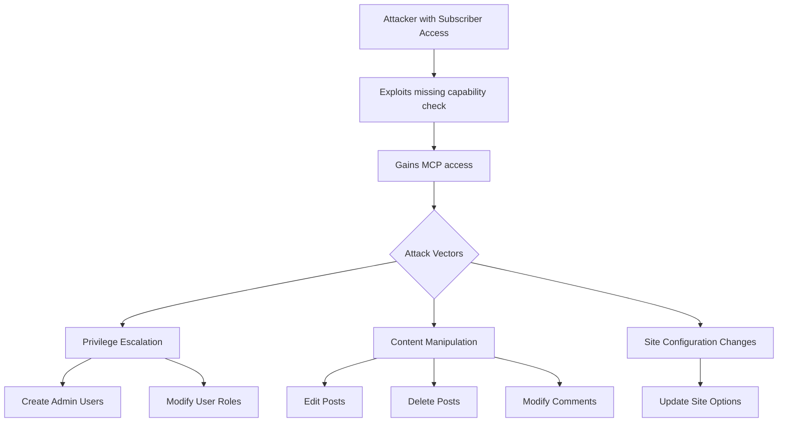

# CVE-2025-5071 - AI Engine WordPress Plugin Vulnerability

## 📋 Executive Summary

**CVE-2025-5071** is a high-severity authorization vulnerability in the AI Engine plugin for WordPress that allows authenticated attackers with subscriber-level privileges to perform unauthorized actions including privilege escalation, content modification, and site takeover. With a CVSS score of 8.8, this vulnerability poses significant risk to WordPress sites using affected versions of the plugin.

---

## 🚨 Quick Facts

| Metric | Details |
| :--- | :--- |
| **CVE ID** | CVE-2025-5071 |
| **CVSS Score** | 8.8 (High) (CNA/Wordfence) |
| **Vulnerability Type** | Incorrect Authorization (CWE-863)  |
| **Attack Vector** | Network  |
| **Privileges Required** | Low (Subscriber)  |
| **Affected Product** | AI Engine WordPress Plugin  |
| **Affected Versions** | 2.8.0 through 2.8.3  |
| **Patched Version** | 2.8.4 and later  |
| **Publication Date** | June 19, 2025  |

---

## 🔍 Technical Details

### Vulnerability Overview

CVE-2025-5071 is an **incorrect authorization** vulnerability in the AI Engine WordPress plugin that allows authenticated attackers with subscriber-level access to bypass security controls and gain full access to the Model Context Protocol (MCP) functionality . The vulnerability exists due to a missing capability check on the `Meow_MWAI_Labs_MCP::can_access_mcp` function, enabling privilege escalation and unauthorized system modifications .

### Attack Mechanism



### Technical Root Cause

The vulnerability stems from insufficient authorization checks in the MCP module of the AI Engine plugin . Specifically:

- **Missing Capability Check**: The `can_access_mcp` function fails to verify if the current user has appropriate administrative privileges
- **Weak Access Control**: Subscriber-level users can access functionality intended only for administrators
- **Function Exposure**: Critical WordPress functions become accessible to low-privileged users

### Exploitable Functions

Attackers can leverage this vulnerability to execute various WordPress core functions :

**Privilege Escalation Commands:**
- `wp_create_user` - Create new user accounts
- `wp_update_user` - Modify existing user roles and privileges
- `wp_update_option` - Change site-wide configuration settings

**Content Manipulation Commands:**
- `wp_update_post` - Modify existing posts and pages
- `wp_delete_post` - Remove posts and pages
- `wp_update_comment` - Edit comments
- `wp_delete_comment` - Delete comments

---

## 📊 Impact Assessment

### Potential Consequences

| Impact Category | Level | Description |
| :--- | :--- | :--- |
| **Confidentiality** | 🔴 High | Attackers can access and exfiltrate sensitive content and user data  |
| **Integrity** | 🔴 High | Complete control over site content, users, and configuration  |
| **Availability** | 🔴 High | Potential for complete site takeover and service disruption  |

### Attack Scenarios

- **Site Takeover**: Attackers can create administrator accounts and gain full control of the WordPress site
- **Content Defacement**: Malicious modification or deletion of posts, pages, and comments
- **Business Disruption**: Critical content removal leading to service unavailability
- **Data Breach**: Access to sensitive information contained in posts and user data

### CVSS 3.1 Vector Breakdown

- **Attack Vector (AV)**: Network - Exploitable remotely over the network
- **Attack Complexity (AC)**: Low - No specialized conditions required
- **Privileges Required (PR)**: Low - Subscriber-level access sufficient
- **User Interaction (UI)**: None - No user interaction required
- **Scope (S)**: Unchanged - Affects only the vulnerable component

---

## 🛡️ Mitigation & Response

### Immediate Actions

#### 🔧 Patch Implementation
```bash
# Update AI Engine plugin to version 2.8.4 or later
# Through WordPress admin dashboard:
# Plugins → Installed Plugins → AI Engine → Update Now
```

#### ⚡ Emergency Workarounds
- **Temporary Disable**: Deactivate AI Engine plugin if immediate update isn't possible
- **User Management**: Review and monitor user accounts for unauthorized subscriber registrations
- **Access Logging**: Implement comprehensive user activity monitoring

### Patch Analysis

The vulnerability was addressed in AI Engine version 2.8.4 through :

- **Authorization Enforcement**: Proper capability checks implemented for MCP access
- **Role Validation**: Verification of administrative privileges for sensitive operations
- **Function Security**: Restriction of core WordPress functions to authorized users only

### Security Hardening Recommendations

#### WordPress Configuration
- **Minimal Privileges**: Apply principle of least privilege for user roles
- **Regular Audits**: Conduct periodic user account and capability reviews
- **Security Plugins**: Deploy WordPress security plugins with integrity monitoring

#### Monitoring & Detection
- **User Activity**: Monitor for unusual subscriber-level activities
- **File Integrity**: Detect unauthorized plugin or core file modifications
- **Access Patterns**: Alert on multiple subscriber registrations from unusual locations

---

## 🔍 Detection & Monitoring

### Indicators of Compromise

#### 🚨 Suspicious Activity Patterns
- Subscriber users performing administrative functions
- Unauthorized user role changes, especially privilege escalations
- Unexpected new user registrations with elevated privileges
- Unexplained content modifications or deletions

#### 🔍 Forensic Artifacts
- Modified AI Engine plugin files in versions 2.8.0-2.8.3
- Unusual database entries in user meta and post meta tables
- WordPress audit logs showing subscribers accessing admin functions

### Security Assessment

- **Plugin Inventory**: Identify affected AI Engine versions (2.8.0-2.8.3)
- **User Audit**: Review user accounts for unauthorized administrative privileges
- **Content Review**: Check for unexplained post or comment modifications

---

## 📈 Exploitation Status

### Current Threat Landscape

| Aspect | Status |
| :--- | :--- |
| **Proof of Concept** | Not Publicly Available  |
| **Exploit Availability** | No evidence of public exploits  |
| **Patch Availability** | Yes (Version 2.8.4+)  |
| **SSVC Exploitation** | None  |

### Attack Complexity Assessment

- **Technical Difficulty**: Low - Straightforward exploitation once identified
- **Reliability**: High - Consistent exploitation with valid subscriber credentials
- **Detection Evasion**: Medium - Blends with legitimate user activities

---

## 🔮 Lessons Learned & Best Practices

### WordPress Security Considerations

#### Secure Development Practices
- **Capability Checks**: Implement proper WordPress capability checks for all administrative functions
- **Role-Based Access**: Enforce strict role-based access control (RBAC) principles
- **Input Validation**: Validate and sanitize all user inputs and function calls
- **Security Testing**: Conduct thorough security reviews of plugin authorization mechanisms

#### Organizational Security Measures
- **Update Management**: Establish processes for timely plugin updates and security patches
- **User Management**: Implement strict controls over user registration and role assignments
- **Backup Strategies**: Maintain regular backups for quick recovery from compromises
- **Security Monitoring**: Deploy WordPress-specific security monitoring solutions

### Future Prevention Strategies

- **Code Review**: Regular security-focused code reviews for plugin development
- **Vulnerability Scanning**: Implement automated vulnerability scanning for WordPress ecosystems
- **Security Awareness**: Train content managers on recognizing suspicious activities
- **Patch Management**: Automated update procedures for WordPress plugins and themes

---

## 📚 References & Resources

### Official Advisories
1. [Wordfence Threat Intelligence - CVE-2025-5071](https://www.wordfence.com/threat-intel/vulnerabilities/id/0e7654a1-0020-4bf1-86be-bdb238a9fe0d?source=cve) 
2. [NVD CVE-2025-5071 Detail](https://nvd.nist.gov/vuln/detail/CVE-2025-5071) 
3. [INCIBE Vulnerability Database](https://www.incibe.es/en/incibe-cert/early-warning/vulnerabilities/cve-2025-5071) 

### Technical Resources
- [WordPress Plugin Security Guidelines](https://developer.wordpress.org/plugins/security/)
- [WordPress Capabilities Reference](https://wordpress.org/documentation/article/roles-and-capabilities/)
- [CWE-863: Incorrect Authorization](https://cwe.mitre.org/data/definitions/863.html)

### Additional Resources
- [Tenable CPE Analysis](https://www.tenable.com/cve/CVE-2025-5071/cpes) 
- [Qualys Detection QID 530206](https://notifications.qualys.com/notifications/2025/06/30/web-application-detections-published-in-june-2025) 

---

## ⚠️ Disclaimer

This document is provided for informational and educational purposes only. The vulnerability has been addressed in AI Engine plugin version 2.8.4 and later. Organizations should conduct their own risk assessment and testing before implementing any security measures. Always refer to official security advisories for the most current information.

---

<div align="center">

**Last Updated**: November 2025  
**Status**: ✅ **Patched in version 2.8.4**  

</div>
