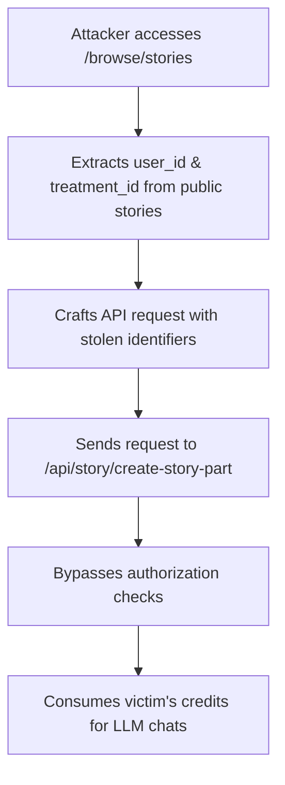

# CVE-2025-51867 - Deepfiction AI IDOR Vulnerability

## 📋 Executive Summary

**CVE-2025-51867** is a medium-severity Insecure Direct Object Reference (IDOR) vulnerability in Deepfiction AI's platform that allows authenticated attackers to consume other users' chat credits and access proprietary AI character configurations. This authorization bypass enables financial abuse through credit theft and exposes sensitive system resources.

---

## 🚨 Quick Facts

| Metric | Details |
|--------|---------|
| **CVE ID** | CVE-2025-51867 |
| **CVSS Score** | 6.5 (Medium) (CISA/ADP) |
| **Vulnerability Type** | Authorization Bypass (CWE-639) |
| **Attack Vector** | Network |
| **Privileges Required** | Low |
| **Affected Product** | Deepfiction AI Platform |
| **Affected Versions** | Through June 3, 2025 |
| **Publication Date** | July 22, 2025 |
| **Last Modified** | July 25, 2025 |

---

## 🔍 Technical Details

### Vulnerability Overview

CVE-2025-51867 is an **Insecure Direct Object Reference (IDOR)** vulnerability in Deepfiction AI's chat component that allows attackers to bypass authorization controls and utilize other users' credits for Large Language Model (LLM) interactions . The vulnerability stems from improper access control mechanisms in the story creation API endpoint combined with information exposure through public browsing features.

### Attack Mechanism

### Technical Root Cause

The vulnerability exists in the API endpoint `https://www.deepfiction.ai/api/story/create-story-part`, which relies solely on the `treatment_id` and `user_id` fields in the request body for access control, without implementing proper authorization checks . These sensitive identifiers are exposed through the publicly accessible `/browse/stories` endpoint, where the `id` field maps to `treatment_id` and `author_id` maps to `user_id` .

### Exploitation Requirements

- **Authentication**: Low-privilege user account on Deepfiction AI
- **Access**: Ability to browse public stories and make API requests
- **Complexity**: Low - straightforward identifier substitution attack

### Additional Impact: Sensitive Data Exposure

Beyond credit theft, attackers can also access proprietary system resources through network traffic analysis . The specific role configurations (character settings) for each Character, which function as system prompts for the LLM ChatBot, can be captured via packet inspection, potentially revealing proprietary prompt engineering details and character definitions .

---

## 📊 Impact Assessment

### Potential Consequences

| Impact Category | Level | Description |
|----------------|-------|-------------|
| **Confidentiality** | 🔴 High | Unauthorized access to AI chat services and proprietary prompt configurations |
| **Integrity** | 🟢 None | No direct integrity impact |
| **Availability** | 🟢 None | No availability impact |

### Business Impact

- **Financial Loss**: Direct monetary impact through stolen chat credits 
- **Intellectual Property Exposure**: Potential leakage of proprietary AI prompt engineering techniques 
- **User Trust Erosion**: Compromised account security and resource protection

### CVSS 3.1 Vector Breakdown

- **Attack Vector (AV)**: Network - exploitable remotely over the network 
- **Attack Complexity (AC)**: Low - no specialized conditions required 
- **Privileges Required (PR)**: Low - requires low-privilege user account 
- **User Interaction (UI)**: None - no user interaction required 
- **Scope (S)**: Unchanged - affects only the vulnerable component 

---

## 🛡️ Mitigation & Response

### Security Recommendations

#### Immediate Remediation
- **Access Control Implementation**: Enforce proper authorization checks verifying users can only access their own resources 
- **Data Exposure Reduction**: Remove sensitive identifiers (`user_id`, `treatment_id`) from public API responses 
- **Input Validation**: Implement strict validation for all user-controlled parameters in API endpoints 

#### Security Hardening
- **API Security**: Implement role-based access control and token-based authentication
- **Data Sanitization**: Sanitize all API responses to remove sensitive internal identifiers
- **Monitoring**: Deploy anomaly detection for unusual credit consumption patterns

### Patch Status

The vulnerability affects Deepfiction AI versions through June 3, 2025 . Organizations should verify with Deepfiction AI regarding specific patched versions and update accordingly.

---

## 🔍 Detection & Monitoring

### Indicators of Compromise

#### 🚨 Suspicious Activity Patterns
- Unusual API request patterns to `/api/story/create-story-part` with mismatched user identifiers
- Rapid credit consumption across multiple user accounts
- API requests containing user/treatment identifiers not associated with the authenticated user

#### 🔍 Forensic Artifacts
- Network logs showing requests to browse endpoint followed by story creation API calls
- User accounts experiencing unexpected credit depletion
- API access logs containing inconsistent user-story relationships

### Security Assessment

- **Exploit Availability**: Public proof-of-concept available 
- **Exploitation Status**: No evidence of active exploitation 
- **EPSS Score**: 0.02% probability of exploitation 

---

## 📈 Vulnerability Context

### AI Security Landscape

CVE-2025-51867 represents one of the emerging **access control issues** in AI systems, categorized alongside other AI-related vulnerabilities in 2025 . This vulnerability highlights how traditional web application vulnerabilities like IDOR manifest in AI-powered platforms, particularly those with credit-based consumption models.

### Statistical Context

According to AI vulnerability analysis for 2025, access control issues including IDOR vulnerabilities represent approximately 23% of all AI-related CVEs, making them the third most common category after Remote Code Execution (31%) and Prompt Injection (23%) .

---

## 🔮 Lessons Learned & Best Practices

### AI Platform Security

#### Secure Development Practices
- **Zero Trust Architecture**: Implement strict verification for all resource access requests
- **API Security**: Never rely solely on client-provided identifiers for authorization decisions
- **Data Minimization**: Avoid exposing internal identifiers in public API responses

#### Business Protection
- **Credit System Security**: Implement additional fraud detection for credit consumption anomalies
- **User Education**: Educate users on monitoring their credit usage for suspicious activity
- **Regular Audits**: Conduct periodic security assessments of AI consumption interfaces

### Organizational Security Measures

- **Third-Party Assessment**: Security evaluation of AI platform providers before adoption
- **Credit Monitoring**: Implement alerts for unusual credit consumption patterns
- **Incident Response**: Prepare procedures for credit fraud and resource misuse scenarios

---

## 📚 References & Resources

### Official Advisories
1. [NVD CVE-2025-51867 Detail](https://nvd.nist.gov/vuln/detail/CVE-2025-51867) 
2. [CISA Vulnerability Bulletin SB25-209](https://www.cisa.gov/news-events/bulletins/sb25-209) 

### Technical Analysis
1. [GitHub Proof-of-Concept Repository](https://github.com/Secsys-FDU/CVE-2025-51867) 
2. [Fluency Security AI Vulnerability Analysis 2025](https://blogs.fluencysecurity.com/ai-cves-of-2025/) 

### Additional Resources
- [CWE-639: Authorization Bypass Through User-Controlled Key](https://cwe.mitre.org/data/definitions/639.html) 
- [OWASP API Security Top 10](https://owasp.org/www-project-api-security/)

---

## ⚠️ Disclaimer

This document is provided for informational and educational purposes only. The vulnerability affects Deepfiction AI versions through June 3, 2025. Organizations should conduct their own risk assessment and verification of patch status with the vendor. Always refer to official security advisories for the most current information.

---

**Last Updated**: November 2025  
**Status**: 🟠 **Medium Severity - Patch Verification Recommended**  

