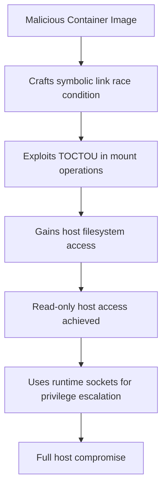

# CVE-2025-23359 - NVIDIA Container Toolkit TOCTOU Vulnerability

## 📋 Executive Summary

**CVE-2025-23359** is a high-severity Time-of-Check Time-of-Use (TOCTOU) vulnerability in the NVIDIA Container Toolkit that allows malicious container images to break container isolation and access the host file system. This race condition vulnerability affects default configurations and can lead to full host compromise in AI/GPU-accelerated environments.

---

## 🚨 Quick Facts

| Metric | Details |
|--------|---------|
| **CVE ID** | CVE-2025-23359 |
| **CVSS Score** | 8.3 (High) (CNA/NVIDIA Corporation) |
| **Vulnerability Type** | TOCTOU Race Condition (CWE-367)  |
| **Attack Vector** | Network  |
| **User Interaction** | Required  |
| **Affected Product** | NVIDIA Container Toolkit & GPU Operator  |
| **Affected Versions** | ≤ 1.17.3 (Toolkit), ≤ 24.9.1 (GPU Operator)  |
| **Patched Versions** | 1.17.4+, 24.9.2+  |
| **Publication Date** | February 11, 2025  |
| **Exploit Status** | Proof-of-Concept Available  |

---

## 🔍 Technical Details

### Vulnerability Overview

CVE-2025-23359 is a **Time-of-Check Time-of-Use (TOCTOU) race condition** in the NVIDIA Container Toolkit that enables malicious container images to bypass container isolation and access the host file system . This vulnerability represents a bypass for the previously patched CVE-2024-0132, demonstrating incomplete remediation of the original issue .

### Attack Mechanism



### Technical Root Cause

The vulnerability exists in the file path validation during mount operations, where attackers can manipulate paths using symbolic links to create a race condition . Specifically:

- **Weakness**: CWE-367 - Time-of-check Time-of-use Race Condition 
- **Attack Pattern**: CAPEC-27 - Leveraging Race Conditions via Symbolic Links 
- **Initial Impact**: Read-only access to host file system 
- **Escalation**: Interaction with container runtime Unix sockets for privileged container execution 

### Exploitation Requirements

- **Default Configuration**: Vulnerability only exists with default settings 
- **Container Execution**: Ability to run crafted container images 
- **Network Access**: Attack vector classified as Network (AV:N) 
- **User Interaction**: Requires some user interaction (UI:R) 

---

## 📊 Impact Assessment

### Potential Consequences

| Impact Category | Level | Description |
|----------------|-------|-------------|
| **Confidentiality** | 🔴 High | Host file system access and information disclosure  |
| **Integrity** | 🔴 High | Data tampering and unauthorized system modifications  |
| **Availability** | 🔴 High | Denial of service capabilities  |

### Attack Scenarios

- **Container Escape**: Break out of container isolation to host environment 
- **Host Compromise**: Full system control through privileged container execution 
- **Multi-tenant Breaches**: Cross-tenant data access in cloud environments 
- **AI Infrastructure Risk**: Compromise of GPU-accelerated AI workloads and models 

### CVSS 3.1 Vector Breakdown 

- **Attack Vector (AV)**: Network - Exploitable remotely over network
- **Attack Complexity (AC)**: High - Requires race condition exploitation
- **Privileges Required (PR)**: None - No special privileges needed
- **User Interaction (UI)**: Required - Some user interaction necessary
- **Scope (S)**: Changed - Can affect components beyond security scope

---

## 🛡️ Mitigation & Response

### Immediate Actions

#### 🔧 Patch Implementation
```bash
# Update NVIDIA Container Toolkit to version 1.17.4 or later
# Update NVIDIA GPU Operator to version 24.9.2 or later 
```

#### ⚡ Configuration Hardening
- **Maintain Defaults**: Do not modify the `allow-cuda-compat-libs-from-container` flag 
- **CDI Migration**: Consider migrating to Container Device Interface (CDI) which is not affected 
- **Image Validation**: Implement strict container image verification processes 

### Security Hardening Recommendations

#### Kubernetes-Specific Protections 
- **User Namespaces**: Utilize beta feature for additional user isolation
- **Network Policies**: Implement strict network traffic controls within clusters
- **Kubelet Permissions**: Restrict excessive permissions for Kubelet credentials

#### General Security Measures
- **Least Privilege**: Apply principle of least privilege to container deployments 
- **Monitoring**: Deploy anomaly detection for container escape attempts 
- **Runtime Protection**: Use container security monitoring tools

### Workaround Considerations

For applications requiring CUDA Forward Compatibility, NVIDIA recommends:

```toml
# Only if absolutely necessary - this reduces security
[features]
allow-cuda-compat-libs-from-container = true
```

**Warning**: Enabling this feature flag removes protection against CVE-2025-23359 and is not recommended .

---

## 🔍 Detection & Monitoring

### Indicators of Compromise

#### 🚨 Suspicious Activity Patterns
- Unusual symbolic link manipulation in container environments 
- Unexpected host file system access from container contexts 
- Anomalous container behavior involving mount operations 
- Privileged container creation from within existing containers 

#### 🔍 Security Monitoring
- **File Access Patterns**: Monitor for container processes accessing host paths
- **Symbolic Link Activity**: Detect rapid symbolic link changes in container images
- **Runtime Socket Usage**: Alert on container access to host runtime sockets

### Security Assessment

- **Proof-of-Concept**: Publicly available exploitation techniques 
- **Exploitation Likelihood**: EPSS Score 0.04% (11.5th percentile) 
- **Attack Complexity**: High - requires precise timing and conditions 

---

## 📈 Vulnerability Context

### Relationship to Previous Vulnerabilities

CVE-2025-23359 represents a **bypass of CVE-2024-0132**, a critical container escape vulnerability patched in September 2024 . This indicates the original patch was incomplete, highlighting the challenges in properly fixing race condition vulnerabilities in complex container toolchains.

### AI/ML Security Implications

This vulnerability particularly affects AI infrastructure due to:

- **Widespread NVIDIA Toolkit Usage**: Essential for GPU-accelerated AI workloads 
- **Multi-tenant Environments**: Risk of cross-tenant model and data access 
- **Proprietary AI Models**: Potential theft of valuable intellectual property 

---

## 🔮 Lessons Learned & Best Practices

### Container Security Considerations

#### Secure Development Practices
- **Comprehensive Testing**: Extensive race condition testing for container runtime components 
- **Defense in Depth**: Multiple security layers for container isolation 
- **Patch Verification**: Independent validation of security fixes 

#### Infrastructure Security
- **Default Security**: Security-by-default in container toolchain configurations 
- **Runtime Hardening**: Regular security assessment of container runtimes 
- **Update Management**: Automated security updates for critical infrastructure components 

### Organizational Security Measures

- **Vendor Security Assessment**: Regular evaluation of container toolchain security 
- **Incident Response**: Preparation for container escape scenarios 
- **Security Training**: Education on container security risks and mitigation strategies

---

## 📚 References & Resources

### Official Advisories
1. [NVIDIA Security Bulletin - CVE-2025-23359](https://nvidia.custhelp.com/app/answers/detail/a_id/5616) 
2. [NVD CVE-2025-23359 Detail](https://nvd.nist.gov/vuln/detail/CVE-2025-23359) 

### Technical Analysis
1. [Wiz Research - Incomplete Patch Analysis](https://thehackernews.com/2025/04/incomplete-patch-in-nvidia-toolkit.html) 
2. [CVE News - Technical Deep Dive](https://www.cve.news/cve-2025-23359/) 

### Additional Resources
- [CWE-367: Time-of-check Time-of-use Race Condition](https://cwe.mitre.org/data/definitions/367.html)
- [NVIDIA Product Security Portal](https://www.nvidia.com/en-us/product-security/) 

---

## ⚠️ Disclaimer

This document is provided for informational and educational purposes only. The vulnerability has been addressed in NVIDIA Container Toolkit version 1.17.4 and NVIDIA GPU Operator version 24.9.2. Organizations should conduct their own risk assessment and testing before implementing any security measures. Always refer to official NVIDIA security advisories for the most current information.

---

<div align="center">

**Last Updated**: November 2025  
**Status**: ✅ **Patched in versions 1.17.4+ and 24.9.2+**  

</div>
